# 实验一无人值守安装Ubuntu18.04.1
---
## 1.实验准备

- 虚拟机：VIrtualBox 5.2.18 r124319
- 镜像：[ubuntu-18.04.1-server-amd64.iso](http://mirrors.ustc.edu.cn/ubuntu-cdimage/releases/18.04/release/)
- Xshell

## 2.实验过程

### step1：以「有人值守」方式安装好「Ubuntu18.04系统」，并配置双网卡,使用「xshell」基于ssh协议实现主机与虚拟机间的文件传递

- 配置双网卡
  - `sudo vim /etc/netplan/01-netcfg.yaml`
  - 更改为如下内容
    ```
    # This file describes the network interfaces available on your system
    # For more information, see netplan(5).
    network:
      version: 2
      renderer: networkd
      ethernets:
        enp0s3:
          dhcp4: yes
          dhcp6: yes
        enp0s8:
          dhcp4: yes
          dhcp6: yes
          dhcp-identifier: mac
    ```
    示例：
    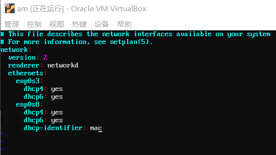

  - 生效后查看网卡配置
     - `netplan apply`
     - `ip a`
      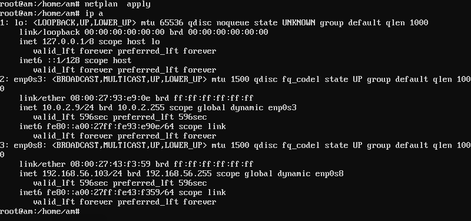

    「enp0s8」显示的ip地址
    > 192.168.56.103
    
- 根据上述地址通过xshell连接虚拟机，在xshell命令行中输入上传命令`rz`上传文件至虚拟机
  
  *rz与sz命令需要在此之前 `apt-get install lrzsz`*

### step2：挂载镜像并同步光盘内容

- `mkdir loopdir`→在当前目录下创建一个用于挂载iso镜像文件的目录
  
- `mount -o loop ubuntu-18.04.4-server-amd64.iso loopdir`→挂载iso镜像文件
  >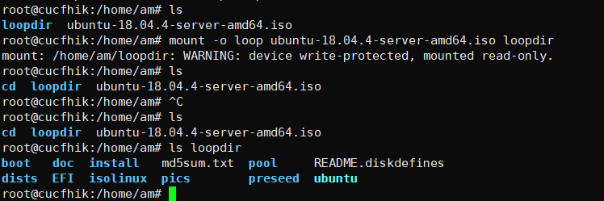

- `mkdir cd`
- `rsync -av loopdir/ cd`→同步光盘到cd文件夹内
  >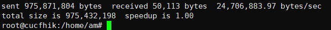

- `sudo umount loopdir`→卸载镜像

### step3：制作「custom.iso」镜像

- `vim isolinux/txt.cfg`→编辑Ubuntu安装引导界面增加新菜单项入口
- 添加以下内容
  ```
  label autoinstall
         menu label ^Auto Install Ubuntu Server
         kernel /install/vmlinuz
         append  file=/cdrom/preseed/ubuntu-server-autoinstall.seed debian-installer/locale=en_US console-setup/layoutcode=us keyboard-configuration/layoutcode=us console-setup/ask_detect=false localechooser/translation/warn-light=true localechooser/translation/warn-severe=true initrd=/install/initrd.gz root=/dev/ram rw quiet
  ``` 
  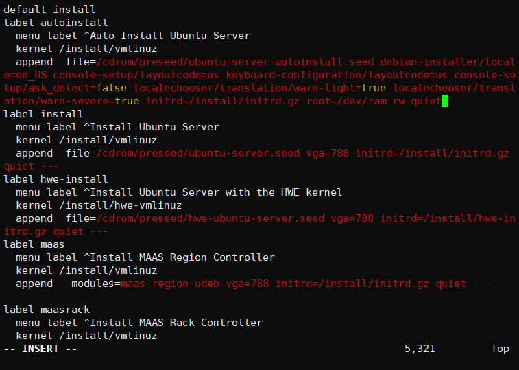
 
- 定制press.cfg，将其保存至`/home/am/cd/preseed/ubuntu-server-autoinstall.seed  \`
  - 这里借助的是老师的力量→「[ubuntu-server-autoinstall.seed](https://github.com/c4pr1c3/LinuxSysAdmin/blob/master/exp/chap0x01/cd-rom/preseed/ubuntu-server-autoinstall.seed)」(完成后有做一点修改，但是录屏上传至b站审核完毕的周期太长，因此录屏是老师的preseed文件为基础的)
  
- `vim isolinux/isolinux.cfg`→修改timeout=10 
  
- cd目录内执行`find . -type f -print0 | xargs -0 md5sum > md5sum.txt`重新生成md5sum.txt

- 设置变量IMAGE和BUILD
  ```
  IMAGE=custom.iso
  BUILD=~/cd/
  ```
- 封闭目录生成custom.iso
  ```
  mkisofs -r -V "Custom Ubuntu Install CD" \
              -cache-inodes \
              -J -l -b isolinux/isolinux.bin \
              -c isolinux/boot.cat -no-emul-boot \
              -boot-load-size 4 -boot-info-table \
              -o $IMAGE $BUILD
  ```
  *执行上述命令需要`apt-get update`再`apt-get install genisoimage`，原`/etc/apt/source.list`文件更新太太太慢，如果是新配置的虚拟机，阿萌建议换用国内的「阿里源」等进行替换*
  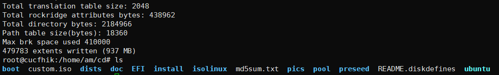

- 在xshell命令行中执行`sz /home/am/cd/custom.iso`将镜像文件从虚拟机下载至主机
  

- 顺利进行无人值守实验（录屏为1.2-1.8倍速）
—————
  [录屏传送门](https://www.bilibili.com/video/av98017971/)
—————
## 3.实验报错及解决

- 做完实验后本来应该是「shutdown」关机但是咳咳看了老师视频里一个连贯自然地「poweroff」于是双手便鬼使神差地照打了，赶忙重启时发现GNU已经面带微笑地恭候我的光临
  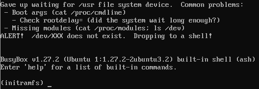
  *在尝试n次修复后还是果断选择了重装一个虚拟机つ﹏⊂*

- 第一次生成custom.iso镜像时，在确认preseed文件与txt.cfg文件操作正确的情况下仍旧出现了报错。
  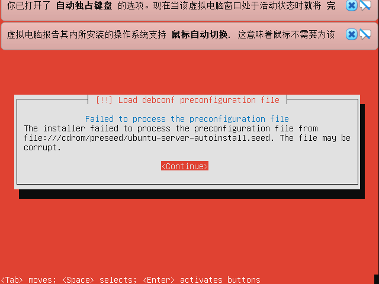
  不过此时正好原虚拟机「poweroff」正在ICU抢救，于是用相同的步骤在新的虚拟机上执行，生成的custom.iso文件却能正常进行无人值守实验。

## 4.实验问题与思考
---
- 1.老师在自己制定好的ubuntu-server-autoinstall.seed中做了哪些修改
  >详见Q2的分析
  - 1.1用什么「工具」能提高「差异」比对的效率？
    >正如下图所示，用VScode自带的文件比较功能即可清楚看到修改的位置与内容
    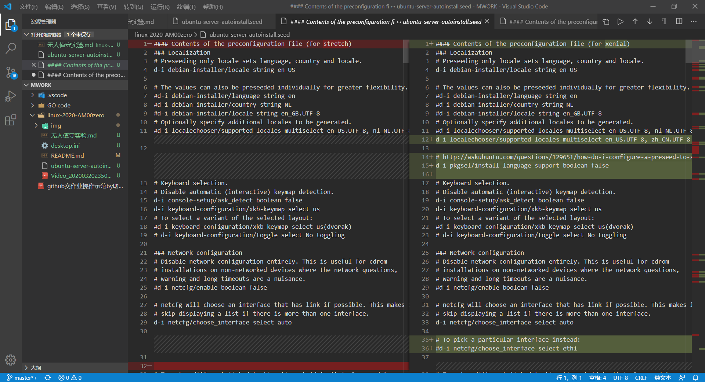
- 2.这些修改的作用是什么？
  > - 地区与语言配置
  > 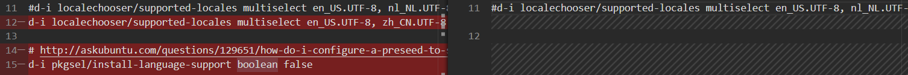
  > - 预置主机名与域名
  > 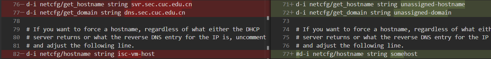
  > - 等待时间限制为5
  > 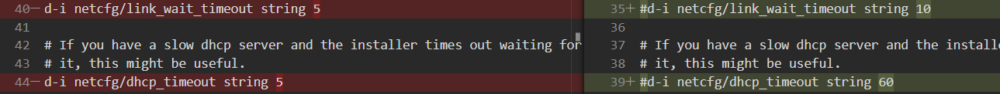
  > - 预设置网络配置
  > 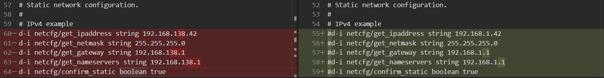
  > - 预设置密码
  > 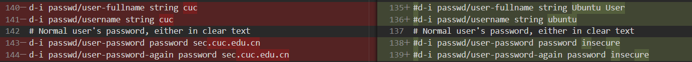
  > - 将时区调至中国上海 
  > 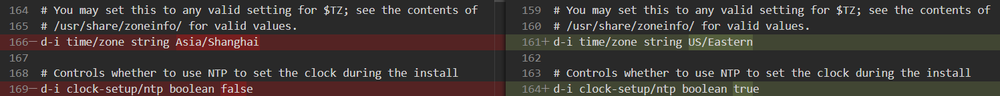
  > - 初始分区自动分配最大
  > 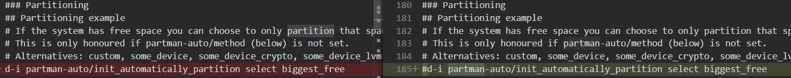
  > - /目录文件预分区为/home,/var与/tmp
  > 
  > 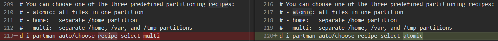
  > - I want to use a network mirror :)
  > 
  > -  选择禁止自动更新
  > 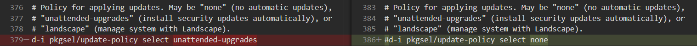
  > - 额外安装openssh-server并在引导结束后不选择更新
  > 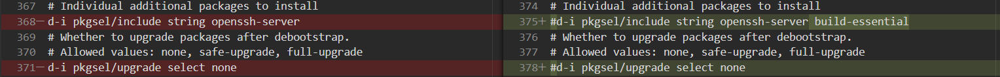
  > - 将原文档中的desktop版本改为server版本
  > 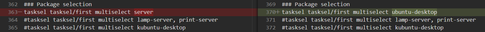
---
## 5.参考资料
- <https://blog.csdn.net/qq_31989521/article/details/58600426>

