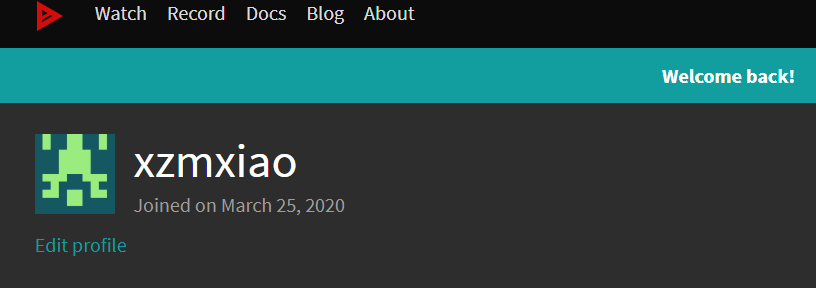
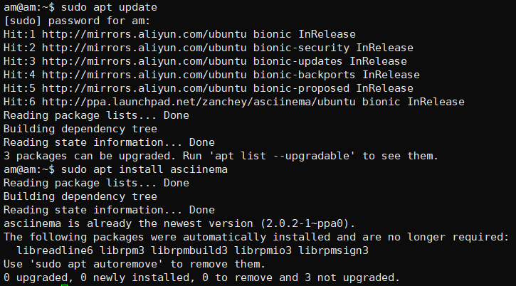
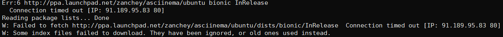
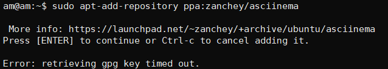
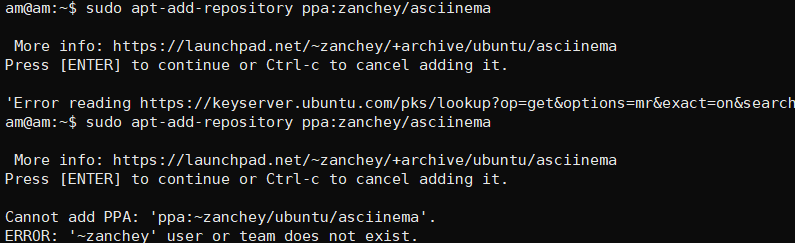

# 实验二：From GUI to CLI

---

## 1.实验准备

- 虚拟机：VIrtualBox 6.1.4 r136177 (Qt5.6.2)
- Linux系统：ubuntu 18.04.4 server 64bit
  
## 2.实验过程

### step1：在主机登录asciinema注册账号，并在Linux端安装配置好asciinema，将本地和在线账号进行关联

- 在[asciinema](https://asciinema.org/)创建账号
  
- 关联用户
  - Ubuntu安装asciinema：
    ```shell
    sudo apt-add-repository ppa:zanchey/asciinema
    sudo apt-get update
    sudo apt-get install asciinema
    ```
    
  - 本地关联：
    ```shell
    asciinema auth
    ```
    
  
### step2：使用asciinema录制vimtutor的全程操作

#### Lesson 1 
  [![asciicast Lseeon 1][lesson1svg]][lesson1]
#### Lesson 2
  [![asciicast Lseeon 2][lesson2svg]][lesson2]
#### Lesson 3
  [![asciicast Lseeon 3][lesson3svg]][lesson3]
#### Lesson 4
  [![asciicast Lseeon 4][lesson4svg]][lesson4]
#### Lesson 5
  [![asciicast Lseeon 5][lesson5svg]][lesson5]
#### Lesson 6
  [![asciicast Lseeon 6][lesson6svg]][lesson6]
#### Lesson 7
  [![asciicast Lseeon 7][lesson7svg]][lesson7]

#### 完整录屏
- （~~对我其实就是之前完整录了一遍发现不符合实验要求但是又舍不得就这么丢了TAT~~）
  [](https://asciinema.org/a/qnCIuInCNpdHqiDPvP1jMk4Of)

### step3：vimtutor自查清单

基于网络上某些博客**广泛流传**的版本（诸如将Command-line视为命令模式等）与vim的「help文档」不符，这里我以vim的[「help.txt」](https://github.com/vim/vim/blob/master/runtime/doc/help.txt)说法为准，尽量避免使用中文名称。

- 你了解vim有哪几种工作模式？
  - Normal mode:普通模式（有说法「命令模式」），使用vim打开文件时的初始模式，可以使用h、j、k、l进行光标移动，也可以用x、d、p等对文件内容进行删改，其他模式可以通过「Esc」返回Normal模式。
  - Visual mode:可视模式，在Normal模式下，使用v、V（行选择)、shift+v和ctrl+v（块选择）都可以进入Visual模式，此时通过光标移动将选择内容高亮；其次还可以通过:set mouse=v进入Visual模式用鼠标移动将选择内容高亮。
  - Insert mode:插入模式，在Normal模式下，使用i、I、a、A、o、O、s、S、c、C都可以进入Insert模式，区别一般在于进入Insert模式后光标的插入位置不同，有的还会在进入Insert模式时执行特定的删除操作。~~其实我一般就只记住i进入QAQ。~~

- Normal模式下，从当前行开始，一次向下移动光标10行的操作方法？如何快速移动到文件开始行和结束行？如何快速跳转到文件中的第N行？
  - 一次向下移动光标10行：10j
  - 移动到文件开始行：gg/1G
  - 移动到文件结束行：G
  - 快速跳转到文件中的第N行：NG / Ngg
- Normal模式下，如何删除单个字符、单个单词、从当前光标位置一直删除到行尾、单行、当前行开始向下数N行？
  - 删除单个字符：
    - 向右删除：x/dl
    - 向左删除：dr
  - 删除单个单词：
    - dw：光标在单词第一个字母；
    - de：光标在单词第一个字母及之前；
    - daw/bdw：光标在单词最后一个字母及之前。
  - 从当前光标位置一直删除到行尾：d$ / D
  - 删除单行：dd
  - 当前行开始向下数N行：Ndd
- 如何在vim中快速插入N个空行？如何在vim中快速输入80个-？
  - 快速插入N个空行：
    - 向下插入：80o / 80[ i / a ]+{Enter}
    - 向上插入：80O
  - 快速输入80个-：80[ i / a ]-
- 如何撤销最近一次编辑操作？如何重做最近一次被撤销的操作？
  - 撤销最近一次编辑操作：u
  - 重做最近一次被撤销的操作：Ctrl+r
- vim中如何实现剪切粘贴单个字符？单个单词？单行？如何实现相似的复制粘贴操作呢？
  - 剪切粘贴：在vim中最近一次删除的内容会被保存在剪切板中，所以对于剪切粘贴操作，无论是字符、单词、行还是内容块，只需要在相应删除它们的操作后按p即可。
  - 复制粘贴：
    - 单个字符：ylp(复制光标所在字符）/yhp（复制光标前一个字符）~~什么古怪字符打不出来需要复制？QWQ~~
    - 单个单词：ywp
    - 行：[N]yyp
    - 内容块：[Visual模式下高亮选择内容块]yp
- 为了编辑一段文本你能想到哪几种操作方式（按键序列）？
  - [ (:set nu/number → Ngg)/(/[Search Content]) → e、0、$ → nh、nj、nk、nl ]光标移动
  - [ Nddp,d* / Nyyp / r ]删除替换
  - [ i/No ]插入操作
  - [ :wq ]保存退出
- 查看当前正在编辑的文件名的方法？查看当前光标所在行的行号的方法？
  - Ctrl+g~~一箭双雕✌~~
- 在文件中进行关键词搜索你会哪些方法？如何设置忽略大小写的情况下进行匹配搜索？如何将匹配的搜索结果进行高亮显示？如何对匹配到的关键词进行批量替换？
  - 关键词搜索：/[Search Content][匹配模式] / ?[Search Content][匹配模式] / 光标移至被搜索关键词处按Shift+* ~~/ 笨拙复杂的办法：%s/[Search Content]/[Search Content]/gc 按n/y向后切换匹配项（似乎不能向前找？）~~
  - 设置忽略大小写：set ic
  - 高亮显示：set hlsearch / set hls
  - 批量替换：[ % / 1949,2020 ]s/[关键字]/[替换字]/gic
- 在文件中最近编辑过的位置来回快速跳转的方法？
  - Ctrl + o, Ctrl + i 
- 如何把光标定位到各种括号的匹配项？例如：找到(, [, or {对应匹配的),], or }
  - 光标移至需要匹配的括号下，按% 
- 在不退出vim的情况下执行一个外部程序的方法？
  - ![外部程序] 
- 如何使用vim的内置帮助系统来查询一个内置默认快捷键的使用方法？如何在两个不同的分屏窗口中移动光标？
  - 查询一个内置默认快捷键的使用方法：help [快捷键]
  - 在两个不同的分屏窗口中移动光标：Ctrl+w + w、h、j、k、l / set mouse=n/a
  
## 3.实验报错及解决

- 在Ubuntu安装asciinema时，使用`sudo apt-add-repository ppa:zanchey/ asciinema`遇到了多种报错：
  - 
  - 
  - 
  
  对于第三种报错查得可能为CA证书损坏，故重装CA证书：
  ```shell
  sudo apt-get install --reinstall ca-certificates
  ```
  报错解决→PPA添加成功：
  - 

## 4.参考文献

- [ubuntu无法添加PPA的解决办法](https://blog.csdn.net/leviopku/article/details/101060133)
- [vim之快速查找功能](https://blog.csdn.net/ballack_linux/article/details/53187283?depth_1-utm_source=distribute.pc_relevant.none-task&utm_source=distribute.pc_relevant.none-task)

## 5.实验外的疑惑

- 受先入为主影响习惯用:wq，但是不知道平时用:x是否更好些？
- :set + Ctrl+d/Tab是一个很便捷的操作，但是对于:set number、:set hlsearch、:set incsearch、:set ignorecase这些命令的简写:set nu、:set hls、:set is、:set ic却搜索不到，这些简写只能根据经验记忆吗？
- github上传了markdown文件，但是明明从VScode预览上代码高亮是可见的，github里就和没有高亮一般，commit+push多次无论是bash还是shell都无果，不得不放弃挣扎 :(

[lesson1]:https://asciinema.org/a/ufSf5s4pAYQFpUffbaj7kspXC
[lesson1svg]:https://asciinema.org/a/ufSf5s4pAYQFpUffbaj7kspXC.svg

[lesson2]:https://asciinema.org/a/et5WyETjrzoI5fz382V6e622x
[lesson2svg]:https://asciinema.org/a/et5WyETjrzoI5fz382V6e622x.svg

[lesson3]:https://asciinema.org/a/6Xk9sPKuxfFe1FJxi6wVjCchC
[lesson3svg]:https://asciinema.org/a/6Xk9sPKuxfFe1FJxi6wVjCchC.svg

[lesson4]:https://asciinema.org/a/ivfmGSWIBJ6WQsqkaKJ0vJW0C
[lesson4svg]:https://asciinema.org/a/ivfmGSWIBJ6WQsqkaKJ0vJW0C.svg

[lesson5]:https://asciinema.org/a/f1GHYW4R2SqswsjCCa7Rd2r33
[lesson5svg]:https://asciinema.org/a/f1GHYW4R2SqswsjCCa7Rd2r33.svg

[lesson6]:https://asciinema.org/a/LQ5McEVxsvlQGRDFGXsNMFMq9
[lesson6svg]:https://asciinema.org/a/LQ5McEVxsvlQGRDFGXsNMFMq9.svg

[lesson7]:https://asciinema.org/a/PCgE2iGDREOxuHrDvfHJnrbQ9
[lesson7svg]:https://asciinema.org/a/PCgE2iGDREOxuHrDvfHJnrbQ9.svg