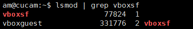

# 实验三：Systemd实战实验

---

## 1.实验准备

- 虚拟机：VIrtualBox 6.1.4 r136177 (Qt5.6.2)
- Linux系统：ubuntu 18.04.4 server 64bit
  
## 2.实验过程

#### Section 1-3 
  [![asciicast Section 1-3][Section1-3svg]][Section1-3]
#### Section 4
  [![asciicast Section 4][Section4svg]][Section4]
#### Section 5
  [![asciicast Section 5][Section5svg]][Section5]
#### Section 6
  [![asciicast Section 6][Section6svg]][Section6]
#### Section 7
  [![asciicast Section 7][Section7svg]][Section7]

## 3.自查清单

1. 如何添加一个用户并使其具备sudo执行程序的权限？
	- 添加用户：
	    ```bash
        sudo adduser 「username」
        ```
	- 将「username」放入「sudo用户组」(多种方法参见「2.」）：
        ```bash
        sudo usermod -a 「username」-G sudo
        ```

2. 如何将一个用户添加到一个用户组
   	- method 1：
        ```bash
        sudo adduser 「username」 「groupname」
        ```
    - method 2：
        ```bash
        sudo usermod -a 「username」-G 「groupname」
        ```
3. 如何查看当前系统的分区表和文件系统详细信息
	- 查看分区表：
    	- `sudo sfdisk -l`：非交互式
    	- `sudo fdisk -l`：据说有bug，但本机输出与「sfdisk -l」无异
    	- `sudo cfdisk`：傻瓜式
    	- `lsblk -a`：仅硬盘分区
        - `df -ah`：全部文件系统列表
    	- `sudo ported -l`
    	- `cat /proc/partitions`
	- 查看文件所在文件系统信息：
    	- `stat -f`：
4. 如何实现开机自动挂载Virtualbox的共享目录分区
	- 在Virtualbox的共享文件夹添加共享的本地文件,勾选自动挂载和固定分配
     	
		
	- `sudo mount /dev/sr0  /media/cdrom`：把sr0挂载到`/media/cdrom`里
  
	- 配置升级好gcc、make、perl等
		
		```bash
		sudo apt-get update
		sudo apt-get install build-essential gcc make perl dkms
		```

	- 安装增强功能并重启生效
  		
		```bash
		sudo /media/cdrom/./VBoxLinuxAdditions.run
		reboot
		```

    - `lsmod | grep vboxsf`：检验增强功能是否安装成功
		

	- `sudo mkdir /mnt/share`创建ubuntu中用于共享的文件目录
  
	- `sudo mount -t vboxsf linux-2020-AM00zero /mnt/shared`将本地共享文件夹挂载到指定目录
		

5. 基于LVM（逻辑分卷管理）的分区如何实现动态扩容和缩减容量？

	```bash
	#缩容
	lvreduce -L -size /dev/dir
	#扩容
	lvextend -L +size /dev/dir
	```
	
6. 如何通过systemd设置实现在网络连通时运行一个指定脚本，在网络断开时运行另一个脚本？
	- 在`/usr/lib/systemd/system`建立在网络连通时运行指定脚本的配置文件MY_SCRIPTA
	
		```bash
		[Unit]
		Description=network up run scriptA
		After=network.target network-online.target network-pre.target #在网络服务连通后运行脚本（即网络连通时）

		[Service]
		Type=oneshot #执行一次
		ExecStart=MY_SCRIPTA_PATH #运行脚本A位置
		
		[Install]
		WantedBy=multi-user.target #多用户模式

		```
	- 在`/usr/lib/systemd/system`建立在网络断开时运行指定脚本的配置文件MY_SCRIPTB
	
		```bash
		[Unit]
		Description=network down run scriptB
		Before=network.target network-online.target network-pre.target #在网络服务连通前运行脚本（即网络断开时）

		[Service]
		Type=oneshot #执行一次
		ExecStart=MY_SCRIPTB_PATH #运行脚本B位置
		
		[Install]
		WantedBy=multi-user.target #多用户模式

		```
	- 重新加载配置文件，然后重新启动相关服务
		
		```bash
		
		# 重新加载配置文件
		sudo systemctl daemon-reload

		# 重启相关服务
		sudo systemctl restart 「service」
		```

7. 如何通过systemd设置实现一个脚本在任何情况下被杀死之后会立即重新启动？实现杀不死？
	- 在`/usr/lib/systemd/system`建立运行指定脚本的配置文件MY_SCRIPTB
	
		```bash
		[Unit]
		Description=KILL ME PLEASE
		
		[Service]
		Type=simple
		ExecStart=MY_SCRIPT_PATH
		ExecStopPost=MY_SCRIPT_PATH
		Restart=always
		RestartSec=1
		RemainAfterExit=yes
		
		[Install]
		WantedBy=multi-user.target
		```
	- 重新加载配置文件，然后重新启动相关服务
		
		```bash
		
		# 重新加载配置文件
		sudo systemctl daemon-reload

		# 重启相关服务
		sudo systemctl restart 「service」
		```


[Section1-3]:https://asciinema.org/a/JJJYMCts64azKqUXk8vsTvjgO
[Section1-3svg]:https://asciinema.org/a/JJJYMCts64azKqUXk8vsTvjgO.svg


[Section4]:https://asciinema.org/a/VcXqAiBQ1xcr9u4CKPSyT6Erp
[Section4svg]:https://asciinema.org/a/VcXqAiBQ1xcr9u4CKPSyT6Erp.svg

[Section5]:https://asciinema.org/a/B4ZisTMffQedVZx6tJIsH27M8
[Section5svg]:https://asciinema.org/a/B4ZisTMffQedVZx6tJIsH27M8.svg

[Section6]:https://asciinema.org/a/rfxD1SlXmVgp3HvjdMb02VPp4
[Section6svg]:https://asciinema.org/a/rfxD1SlXmVgp3HvjdMb02VPp4.svg

[Section7]:https://asciinema.org/a/PalwkJxDSBxByA34juve5d5fG
[Section7svg]:https://asciinema.org/a/PalwkJxDSBxByA34juve5d5fG.svg