# 实验五：web服务器实验

---

## 1.实验环境

- 虚拟机：VIrtualBox 6.1.4 r136177 (Qt5.6.2)
- Linux系统：ubuntu 18.04.4 server 64bit
- windows10 主机
- Nginx：1.14.0-0ubuntu1.7
- VeryNginx
- Wordpress 4.7
- DVWA v1.9
- MySQL5.7.30-0ubuntu0.18.04.1 (Ubuntu)
- PHP 7.2.24-0ubuntu0.18.04.4 (cli) (built: Apr  8 2020 15:45:57) ( NTS )
  
## 2.实验配置与过程实现

- 由于虚拟机内之前配置了apache2，执行以下操作以完全删除apache2及相关服务
    ```bash
    sudo apt purge apache2
    #删除未被删除的配置文件及相关目录
    sudo find /etc -name "*apache*" |xargs  rm -rf
    sudo rm -rf /var/www
    sudo rm -rf /etc/libapache2-mod-jk
    sudo rm -rf /etc/init.d/apache2
    sudo rm -rf /etc/apache2
    #删除关联
    dpkg -l |grep apache2|awk '{print $2}'|xargs dpkg -P
    #检查是否干净卸载
    dpkg -l | grep apache2
    ```
    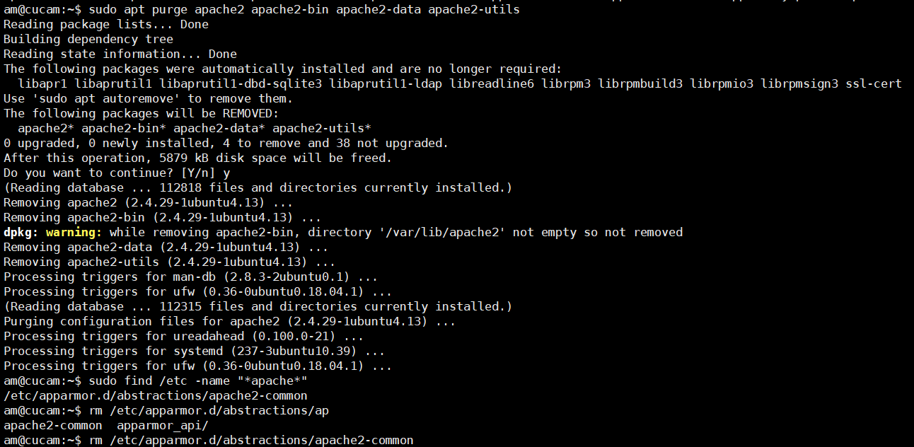
- 主机Windows修改` C:\Windows\System32\drivers\etc`中`hosts`文件，添加域名解析
  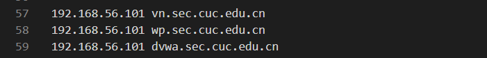
---

#### 【Nginx/MySQL/PHP】

- 直接使用apt命令安装Nginx
    ```bash
    sudo apt update
    sudo apt install nginx
    ```
- 使用`apt policy nginx`确认Nginx版本
  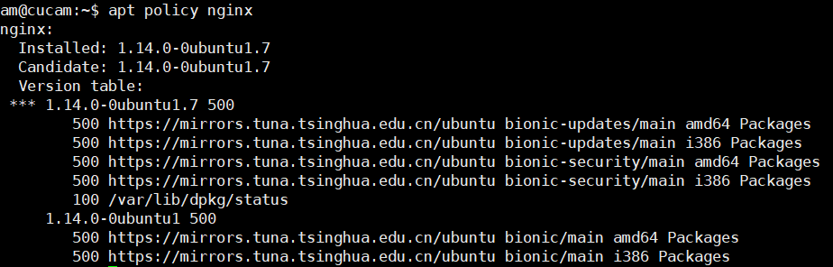

- 安装MySQL
    ```bash
    #apt命令安装MySQL
    sudo apt install mysql-server

    #启动安全脚本
    sudo mysql_secure_installation
    #这里为了实验方便我们不启用VALIDATE PASSWORD PLUGIN，按任意键跳过
    #接下来提交并确认root密码
    #其余问题皆按Y并Enter
    
    #这里出于实验方便我们采用MySQL根用户的默认设置，使用auth_socket插件，直接sudo mysql而不采用密码进入了

    #确认MySQL版本
    mysql -V
    ```
    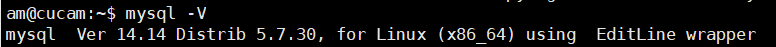
  
- 安装PHP
    ```bash
    #不建议进行sudo add-apt-repository universe，毕竟国外源还是太慢
    #这里我是先add Ubuntu’s universe repository，然后在sources.list内将其注释

    #apt命令安装php-fpm模块以及附加帮助程序包php-mysql
    sudo apt install php-fpm php-mysql

    #查看php版本
    php --version
    ```
    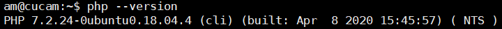

- 在主机访问服务器80端口
  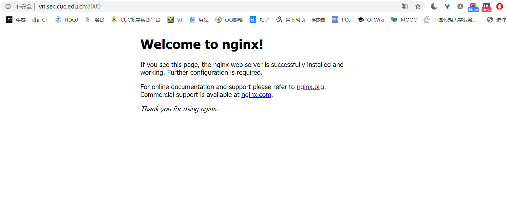


---

#### 【VeryNginx】

- 根据文档提示安装配置VeryNginx
    ```bash
    # 克隆 VeryNginx 仓库到本地, 然后进入仓库目录
    git clone https://github.com/alexazhou/VeryNginx.git
    cd VeryNginx

    # 预安装一些必要的库与依赖项
    # 这里诸如unzip、gcc、make等在之前虚拟机已预安装，故未列入
    sudo apt-get install libpcre3-dev libssl1.0-dev zlib1g-dev build-essential

    # 需要sudo提权以在安装过程中顺利mkdir
    sudo python install.py install verynginx
    # 当出现“All work finished successfully, enjoy it~”，即安装成功
    ```
    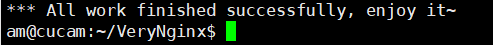
  
- 修改`/opt/verynginx/openresty/nginx/conf/nginx.conf`配置文件
    ```bash
    vim /opt/verynginx/openresty/nginx/conf/nginx.conf
    # 将user从Nginx修改为www-data
    # 修改server监听端口为8000以防止与Nginx冲突
    ```

- 使用`chmod -R 777 /opt/verynginx/verynginx/configs`添加nginx进程对`/opt/verynginx/verynginx/configs/`的写权限，以防止进入VeryNginx配置页面无法保存或其他问题的可能

- 主机访问80端口：
    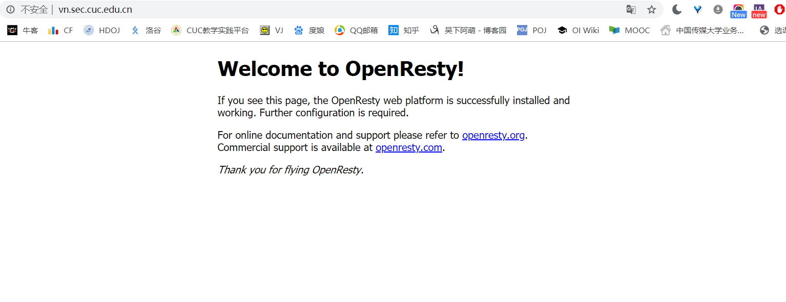

- 在主机访问VeryNginx配置界面，从`http://vn.sec.cuc.edu.cn:8000//verynginx/index.html`登录
    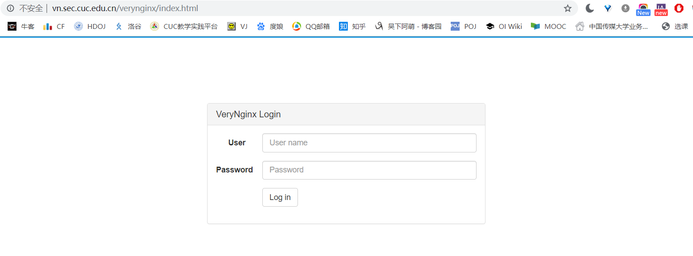 
    输入默认账号密码：
    ```
    User: verynginx
    Password: verynginx 
    ```
    登陆成功，进入配置界面:
    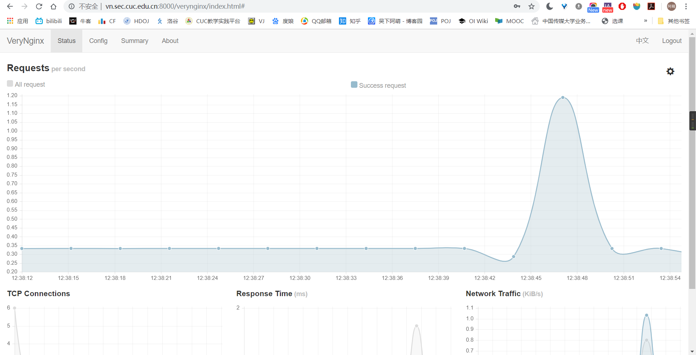

---

#### 【WordPress】

<font size=1>*注：此部分截图是在4.5问题前截取的，因此端口等其他细节方面会有出入，但所有功能都是完整运行且正常的。4.5问题解决后由未名原因wordpress出现了一些渲染的失效，为保证实验报告观看性这里放置4.5问题解决前的截图。*</font>

- 创建数据库和供WordPress使用的用户
    ```bash
    #登录MySQL
    sudo mysql

    #执行MySQL语句
    #为WordPress创建数据库
    mysql> CREATE DATABASE wordpress DEFAULT CHARACTER SET utf8 COLLATE utf8_unicode_ci;
    #创建单独的MySQL用户帐户，设置密码，并授予对我们创建的数据库的访问权限
    mysql> GRANT ALL ON wordpress.* TO 'wordpressuser'@'localhost' IDENTIFIED BY 'password';
    #清除特权，以便MySQL的当前实例知道我们最近所做的更改
    mysql> FLUSH PRIVILEGES;
    #退出MySQL
    mysql> exit;
    ```

- 安装其他PHP扩展 
    ```bash
    sudo apt update
    #apt命令安装
    sudo apt install php-curl php-gd php-intl php-mbstring php-soap php-xml php-xmlrpc php-zip
    
    #重启PHP-FPM进程
    sudo systemctl restart php7.2-fpm
    ```

- [x] 配置PHP-FPM进程的反向代理在nginx服务器上
- 配置Nginx服务器块文件
 
  - 创建新服务器块配置文件
    ```bash
    sudo vim /etc/nginx/sites-available/wp.sec.cuc.edu.cn
    ```
    从中写入如下类似：
    ```bash
    server {
        listen 127.0.0.1:80;

        root /var/www/html/wp.sec.cuc.edu.cn;
        index index.php index.html index.htm index.nginx-debian.html;
        server_name wp.sec.cuc.edu.cn;

        location / {
            #try_files $uri $uri/ =404;
            try_files $uri $uri/ /index.php$is_args$args;
    
        }

        #配置PHP-FPM进程的反向代理配置在nginx服务器上    
        location ~ \.php$ {
            include snippets/fastcgi-php.conf;
            fastcgi_pass unix:/var/run/php/php7.2-fpm.sock;
        }

        location ~ /\.ht {
            deny all
        }
    }
    ```
    
  - 创建从新服务器块配置文件（在/etc/nginx/sites-available/目录中）到/etc/nginx/sites-enabled/目录的符号链接来启用新服务器块
    ```bash
    sudo ln -s /etc/nginx/sites-available/wp.sec.cuc.edu.cn /etc/nginx/sites-enabled/
    ```
  - 从/sites-enabled/目录取消链接默认配置文件
    ```bash
    sudo unlink /etc/nginx/sites-enabled/default
    ```
  - 测试新配置文件的语法错误并重启服务
    ```bash
    sudo nginx -t
    sudo systemctl reload nginx
    ```

- 下载WordPress
    ```bash
    #切换到可写目录，然后通过键入以下命令下载压缩版本：
    cd /tmp
    sudo wget https://wordpress.org/wordpress-4.7.zip
    #解压缩压缩文件以创建WordPress目录结构
    unzip wordpress-4.7.zip

    #将示例配置文件复制到WordPress实际读取的文件名
    cp /tmp/wordpress/wp-config-sample.php /tmp/wordpress/wp-config.php

    #将解压后的wordpress移到指定路径
    sudo mkdir /var/www/html/wp.sec.cuc.edu.cn
    sudo cp -ar /tmp/wordpress/. /var/www/html/wp.sec.cuc.edu.cn

    #将所有权分配给www-data用户和组(这是Nginx运行的用户和组)
    sudo chown -R www-data:www-data /var/www/html/wp.sec.cuc.edu.cn
    ```

- 设置WordPress配置文件
    ```bash
    #从WordPress密钥生成器获取安全值
    curl -s https://api.wordpress.org/secret-key/1.1/salt/
    #将生成的配置行直接粘贴到配置文件中，替换原来包含虚拟值的部分以设置安全密钥
    sudo vim /var/wwhtml/wp.sec.cuc.edu.cn/wp-config.php
    
    #####同时在文件开头修改数据库连接设置，并在任意处设置WordPress应该用于写入文件系统的方法

    define('DB_NAME', 'wordpress');
    /** MySQL database username */
    define('DB_USER', 'wordpressuser');
    /** MySQL database password */
    define('DB_PASSWORD', 'password');

    define('FS_METHOD', 'direct');

    #####

    ```

- 配置VeryNginx访问`wp.sec.cuc.edu.cn`
  - 添加Request Matcher
    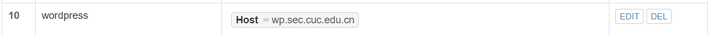
  - 添加Up Stream节点
    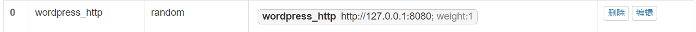 
  - 添加代理通行证
    

- 访问`wp.sec.cuc.edu.cn`,自动进入安装界面
    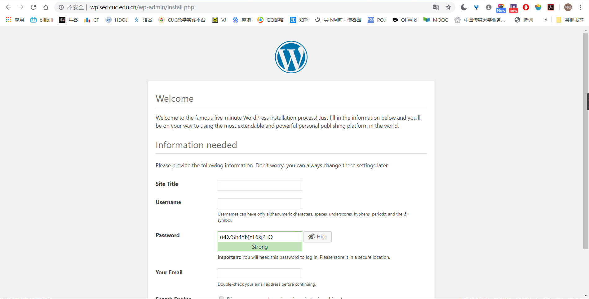
- 信息填写完毕后，进入仪表盘页面，配置好自己的光明山博客叭~（￣︶￣）
    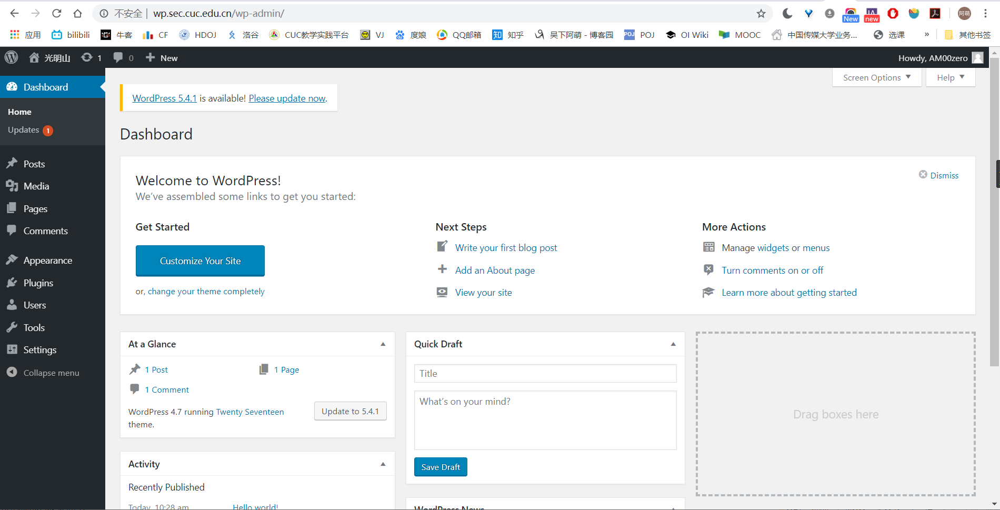
    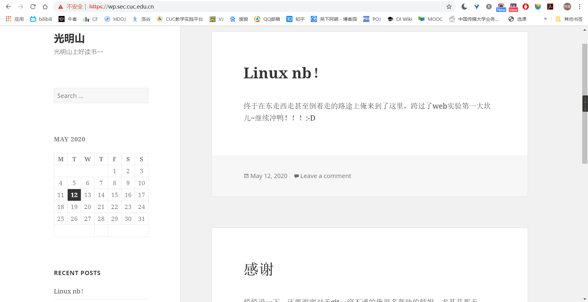

##### 为WordPress启用HTTPS

- 创建自签名SSL证书,输入必要的信息以在目录下创建密钥和证书文件/etc/ssl
    ```bash
    # 使用OpenSSL创建自签名密钥和证书对
    sudo openssl req -x509 -nodes -days 365 -newkey rsa:2048 -keyout /etc/ssl/private/nginx-selfsigned.key -out /etc/ssl/certs/nginx-selfsigned.crt
    ```
    

- 配置Nginx使用SSL
    ```bash
    #创建一个新的Nginx配置片段
    sudo vim /etc/nginx/snippets/self-signed.conf

    #####在其中添入以下内容

    #将ssl_certificate指令设置为的证书文件
    ssl_certificate /etc/ssl/certs/nginx-selfsigned.crt;
    #将ssl_certificate_key设置为关联密钥
    ssl_certificate_key /etc/ssl/private/nginx-selfsigned.key;
    
    #####

    #为了避免在实验外产生不必要的报错，我们并没有额外设定ssl-params.conf配置文件
    
    #备份并修改当前配置文件
    sudo cp /etc/nginx/sites-available/wp.sec.cuc.edu.cn /etc/nginx/sites-available/wp.sec.cuc.edu.cn.bak
    sudo vim /etc/nginx/sites-available/wp.sec.cuc.edu.cn
    
    #####文件修改点如下：

    #1.更新listen指令指向443端口，并包括之前添加的SSL代码段
    listen 127.0.0.1:443 ssl;
    include snippets/self-signed.conf;
    #include snippets/ssl-params.conf;

    #2.配置第二个服务器块,侦听端口80并执行到HTTPS的重定向
    server {
        listen 127.0.0.1:80;

        server_name wp.sec.cuc.edu.cn;

        return 301 https://wp.sec.cuc.edu.cn;
    }

    #####

    #检查文件配置语法
    sudo nginx -t
    #重启Nginx
    sudo systemctl restart nginx
    ```
    
- 配置VeryNginx使用SSL
    ```bash
    #在/opt/verynginx/openresty/nginx/conf/nginx.conf中修改server块，使verynginx监听8443端口
    vim /opt/verynginx/openresty/nginx/conf/nginx.conf
    ```
    ```bash
    server {
      ¦   listen      8000;
      ¦   listen      8433 ssl;
      ¦   include /etc/nginx/snippets/self-signed.conf;
  
  
      ¦   #this line shoud be include in every server block
      ¦   include /opt/verynginx/verynginx/nginx_conf/in_server_block.conf;
  
      ¦   location = / {
      ¦   ¦   root   html;
      ¦   ¦   index  index.html index.htm;
      ¦   }
      }

    ```
    ```bash
    #重启服务
    sudo /opt/verynginx/openresty/nginx/sbin/nginx -s reload
    ```
- 配置VeryNginx访问`https://wp.sec.cuc.edu.cn`
  - 添加Up Stream节点
    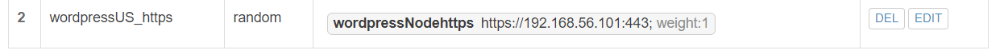 
  - 添加代理通行证
    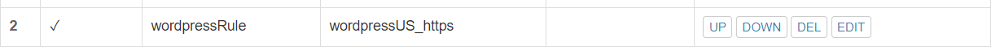
  - 在Scheme Lock添加规则并勾选Enable，以强制访问https
    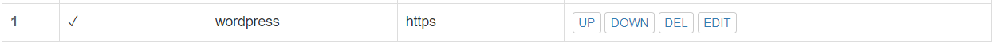
    
- 从ssl端口访问`https://wp.sec.cuc.edu.cn`
    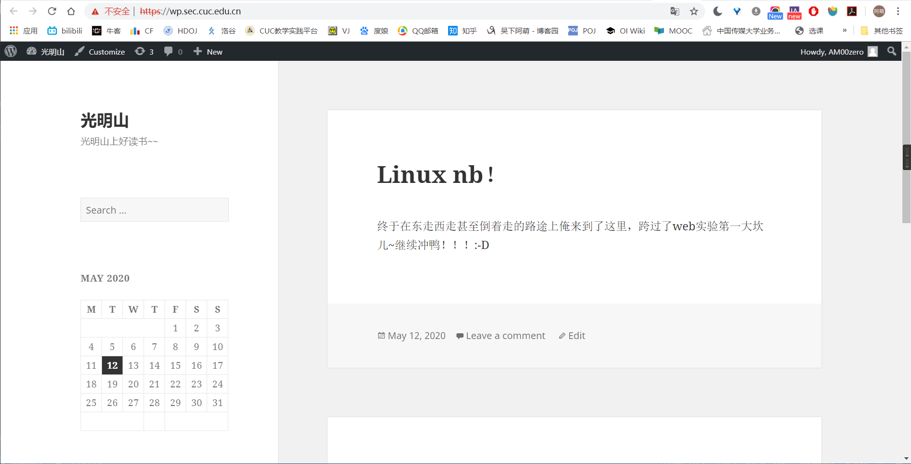

#### 【DVWA】

事实上过程类似于WordPress

- 下载安装
    ```bash
    #将DVWA源码clone到可写目录
    sudo git clone https://github.com/ethicalhack3r/DVWA /tmp/DVWA
    #拷贝至/var/www/html
    sudo mkdir /var/www/html/dvwa.sec.cuc.edu.cn
    sudo cp -r /tmp/DVWA/. /var/www/html/dvwa.sec.cuc.edu.cn
    ```

- 创建数据库和供DVWA使用的用户,这里为了~~懒~~方便，数据库的设置尽可能靠近config.inc.php的默认设置
    ```bash
    #登录MySQL
    sudo mysql

    #执行MySQL语句
    #为dvwa创建数据库
    mysql> CREATE DATABASE dvwa DEFAULT CHARACTER SET utf8 COLLATE utf8_unicode_ci;
    #创建单独的MySQL用户帐户，设置密码，并授予对我们创建的数据库的访问权限
    mysql> GRANT ALL ON  dvwa.* TO 'dvwauser'@'localhost' IDENTIFIED BY 'p@ssw0rd';
    #清除特权，以便MySQL的当前实例知道我们最近所做的更改
    mysql> FLUSH PRIVILEGES;
    #退出MySQL
    mysql> exit;
    ```
- 设置DVWA与PHP等相关环境
    ```bash
    #重命名config.inc.php.dist为config.inc.php，并编辑以适应虚拟机当前环境
    sudo cp /var/www/html/dvwa.sec.cuc.edu.cn/config/config.inc.php.dist /var/www/html/dvwa.sec.cuc.edu.cn/config/config.inc.php
    sudo vim /var/www/html/DVWA/config/config.inc.php
    #由于上述数据库设置尽可能靠近默认设置了，故只需要改动_DVWA[ 'db_user' ]与_DVWA[ 'db_server' ]两项即可

    # 修改php配置
    sudo vim /etc/php/7.2/fpm/php.ini 
    #安装的PHP版本为v7.2>v5.4（版本信息参见实验报告Nginx安装部分）
    #故safe_mode与magic_quotes_gpc的配置我们可以忽略

    #####所需更改配置的最终状态如下：

    allow_url_include = on 
    allow_url_fopen = on
    display_errors = off  #Optional

    #####

    #重启php
    sudo systemctl restart php7.2-fpm
    #将所有权分配给www-data用户和组
    sudo chown -R www-data.www-data /var/www/html/dvwa.sec.cuc.edu.cn
    ```
 
- 创建新服务器块配置文件
    ```bash
    sudo vim /etc/nginx/sites-available/dvwa.sec.cuc.edu.cn
    ```
    从中写入如下类似：
    ```bash
    server {
        listen 127.0.0.1:8008 default_server;

        root /var/www/html/dvwa.sec.cuc.edu.cn;
        index index.php index.html index.htm index.nginx-debian.html;
        server_name dvwa.sec.cuc.edu.cn;

        location / {
            #try_files $uri $uri/ =404;
            try_files $uri $uri/ /index.php$is_args$args;  
        }
  
        location ~ \.php$ {
            include snippets/fastcgi-php.conf;
            fastcgi_pass unix:/var/run/php/php7.2-fpm.sock;
        }

        location ~ /\.ht {
            deny all
        }
    }
    ```
    
- 创建从新服务器块配置文件（在/etc/nginx/sites-available/目录中）到/etc/nginx/sites-enabled/目录的符号链接来启用新服务器块
    ```bash
    sudo ln -s /etc/nginx/sites-available/wp.sec.cuc.edu.cn /etc/nginx/sites-enabled/
    ```

- 测试新配置文件的语法错误并重启服务
    ```bash
    sudo nginx -t
    sudo systemctl reload nginx
    ```

- 配置VeryNginx访问`wp.sec.cuc.edu.cn`
  - 添加Request Matcher
    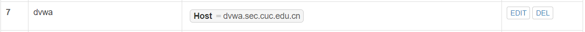
  - 添加Up Stream节点
    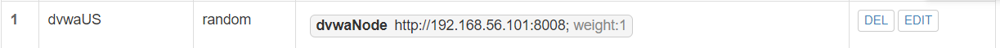 
  - 添加代理通行证
    

- 通过8000端口访问`dvwa.sec.cuc.edu.cn`
    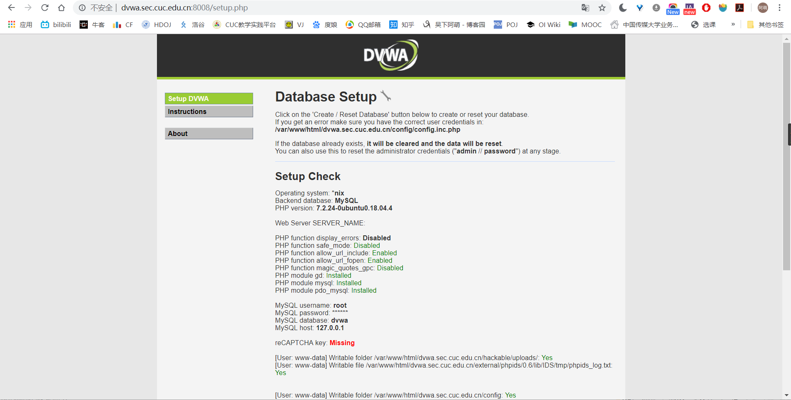
    Create/Reset Database生成需要使用的数据库
    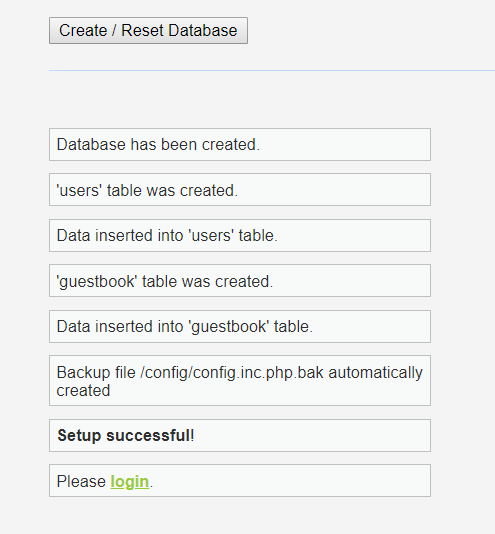
    定向到登录页面，输入默认账号密码：
    ```
    User: admin
    Password: password
    ```
    进入主界面，登录成功~
    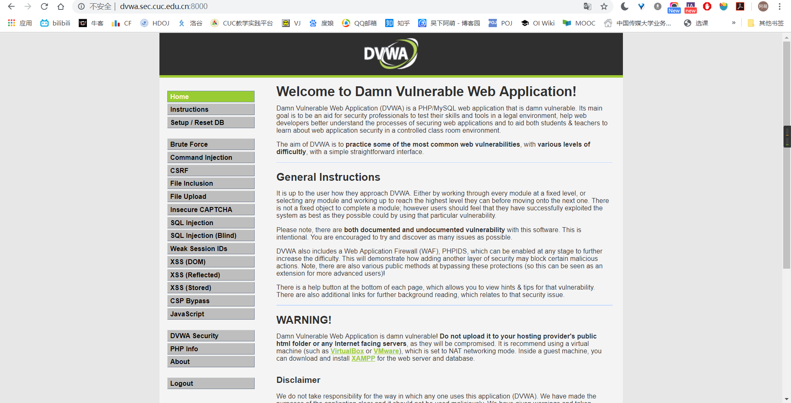

#### 安全加固要求

<font size=1>*注：此部分截图由于4.5问题的原因在实验过程中产生了端口的更换，因此端口等其他细节方面会有出入，但所有功能都是完整运行且正常的。*</font>

##### 1.使用IP地址方式均无法访问上述任意站点

- 通过正则表达式设置匹配器规则，这里我们匹配所有ip地址类型
  即匹配` ((25[0-5]|2[0-4]\d|((1\d{2})|([1-9]?\d)))\.){3}(25[0-5]|2[0-4]\d|((1\d{2})|([1-9]?\d)))`
  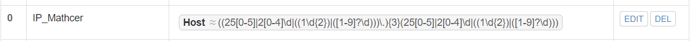
- 设置相应匹配器的Response
  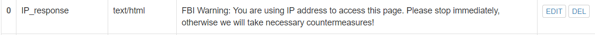
- 设置Filter，返回403Code
  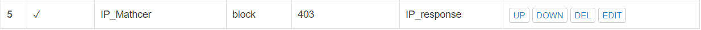
- 此时无法ip形式访问，并返回403（TEXT）~~FBI~~警告
  **友好错误提示信息页面-1**:
  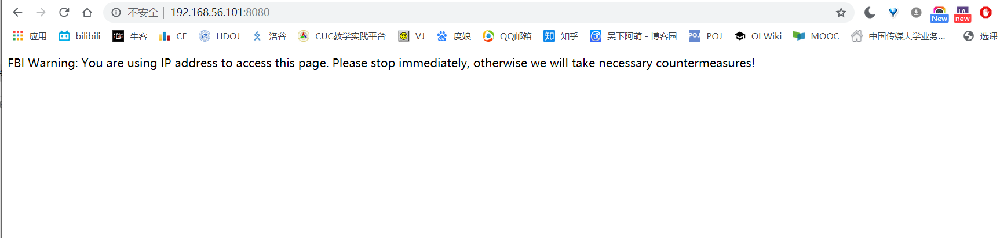

##### 2.DVWA只允许白名单上的访客来源IP

*对于白名单的处置方式有两种思路，我们这里采用第一种*

- 匹配白名单内特定ip
  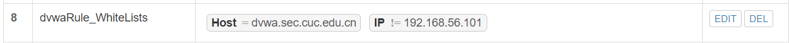
- 设置对于不在白名单范围内ip的Response
  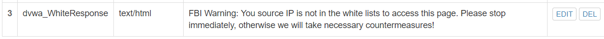
- 设置Filter，返回403Code
  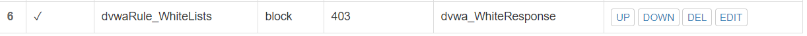
- 此时白名单外访客来源ip无法访问，并返回403（TEXT）~~FBI~~警告
  **友好错误提示信息页面-2**:
  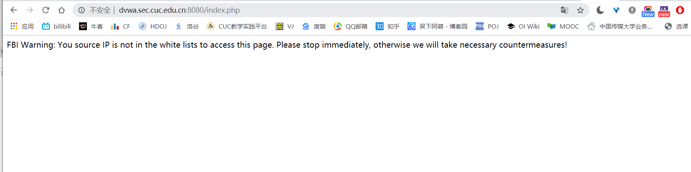
- 白名单内访客来源ip则被允许,这里我们执行wget命令以证明
  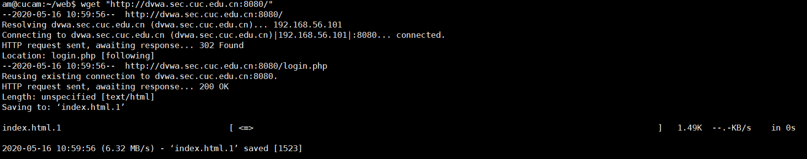

##### 3.在不升级Wordpress版本的情况下，通过定制VeryNginx的访问控制策略规则，热修复WordPress < 4.7.1 - Username Enumeration

- 定制规则前访问`https://wp.sec.cuc.edu.cn/wp-json/wp/v2/users/`可见用户信息
  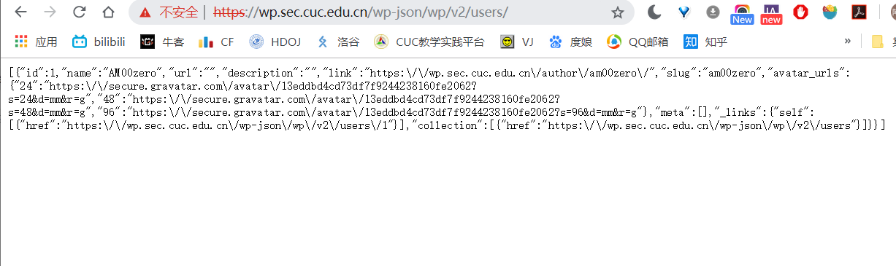
- 定制匹配规则
  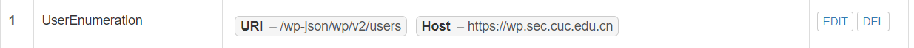
- 设置Filter，由于实验不在此要求返回「自定义的友好错误提示信息页面」，直接返回Code
  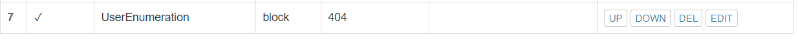
- 此时访问则返回404
  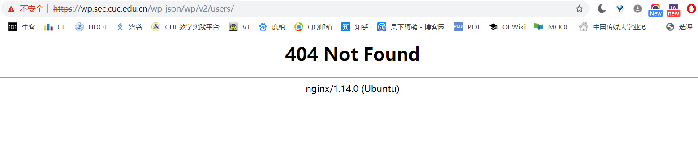

##### 4.通过配置VeryNginx的Filter规则实现对Damn Vulnerable Web Application(DVWA)的SQL注入实验在低安全等级条件下进行防护

- 定制规则前访问测试如下：
  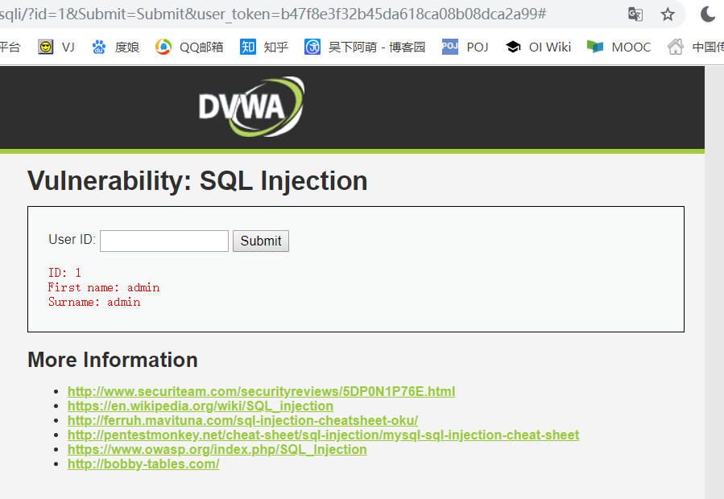
- 根据常见的简单注入攻击定制对应的匹配规则
  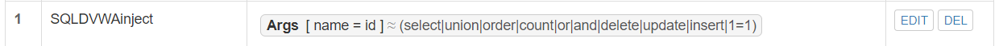
- 设置Filter，由于实验不在此要求返回「自定义的友好错误提示信息页面」，直接返回Code
  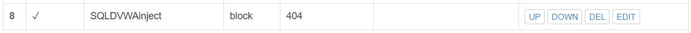
- 此时提交用户ID则返回错误Code
  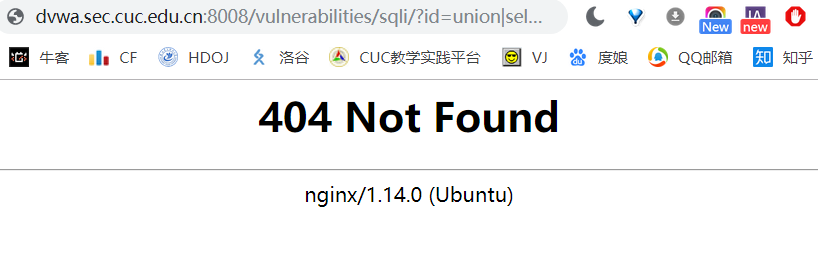

##### 5.VeryNginx的Web管理页面仅允许白名单上的访客来源IP

*这里我们采用第二种对白名单的处置思路*

- 匹配白名单内特定ip
  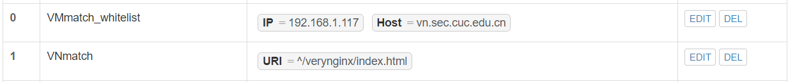
- 设置对于不在白名单范围内ip的Response
  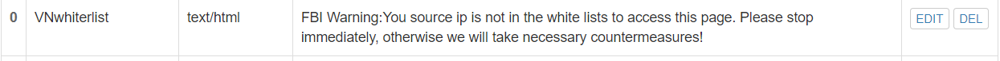
- 设置Filter，先接受白名单内用户，再对之外的返回403Code【**顺序不可变**】
  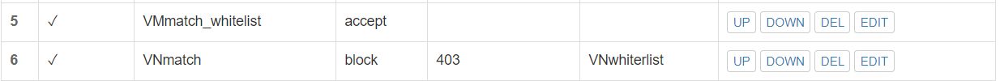
- 此时白名单外访客来源ip无法访问，并返回403（TEXT）~~FBI~~警告
  **友好错误提示信息页面-3**:
  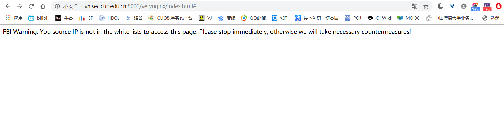

##### 6.定制VeryNginx的访问控制策略规则

- 限制DVWA站点的单IP访问速率为每秒请求数 < 50，限制Wordpress站点的单IP访问速率为每秒请求数 < 20
  - 设置Frequency Limit
    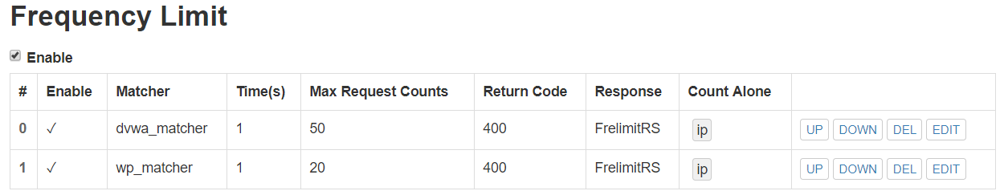
  - 设置对于Response
    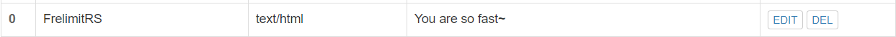
- 压力测试
  - 安装apache2-utils
    ```bash
    sudo apt update
    sudo apt install apache2-utils
    ```
  - 使用ab命令进行压测
    ```bash
    ab -n 100 http://dvwa.sec.cuc.edu.cn:8000/login.php
    ab -n 100 http://wp.sec.cuc.edu.cn:8000/
    ```
  - DVWA测试结果，可见100次访问准备失败50次
    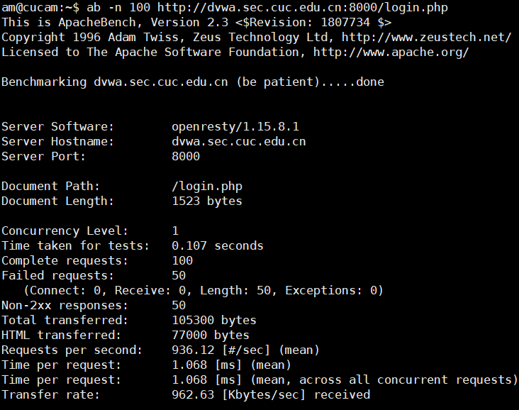
  - wordpress测试结果，可见100次访问准备失败80次
    

- 超过访问频率限制的请求直接返回**自定义错误提示信息页面-4**
  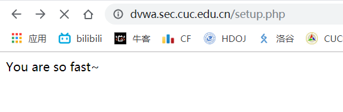
- 禁止curl访问
  - 匹配规则
    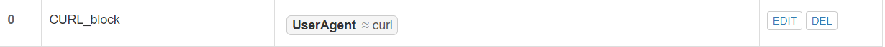
  - Response，返回430Code
    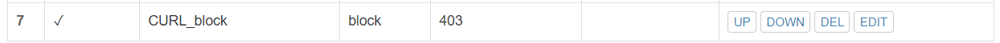
  - curl测试
    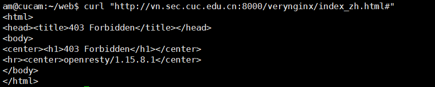

## 4.参考文献

- [1 - How To Install WordPress with LEMP on Ubuntu 18.04](https://www.digitalocean.com/community/tutorials/how-to-install-wordpress-with-lemp-on-ubuntu-18-04)
- [2 - How To Create a Self-Signed SSL Certificate for Nginx in Ubuntu 18.04](https://www.digitalocean.com/community/tutorials/how-to-create-a-self-signed-ssl-certificate-for-nginx-in-ubuntu-18-04)
- [3 - How To Install Linux, Nginx, MySQL, PHP (LEMP stack) on Ubuntu 18.04](https://www.digitalocean.com/community/tags/databases)
- [4 - DAMN VULNERABLE WEB APPLICATION's README.md](https://github.com/ethicalhack3r/DVWA)
- [5 - VeryNginx's readme.md](https://github.com/alexazhou/VeryNginx)
- [6 - jckling实验报告总结1中对于自己实验问题的启示](https://github.com/CUCCS/linux-2019-jckling/blob/0x05/0x05/%E5%AE%9E%E9%AA%8C%E6%8A%A5%E5%91%8A.md)
  - 依此请教师姐，在启发后实验的全部问题都如数解决，师姐赛高！
  - 此问题在上文简以「4.5」称
- [7 - VeryNginx_wiki](https://github.com/alexazhou/VeryNginx/wiki/%E7%9B%AE%E5%BD%95)

## 5.实验插曲

- 登录WordPress博客时某天把密码忘了，输入多次无果后只好重新修改密码，由于某些func的原因不可以通过邮箱找回，于是在虚拟机端修改数据库：
    ```bash
    sudo mysql
    mysql> use wordpress; 
    mysql> UPDATE wp_users SET user_pass = MD5('*****') WHERE wp_users.user_login ='AM00zero' LIMIT 1;
    ```
    最终成功修改密码:-D

- 某日风和日丽忽然怎么进网页都是404500，在认真仔细检查完各种配置文件和端口状态后发现，哦，俺村断网了= =
- 某晚月明星稀，为了实现「VeryNginx的Web管理页面仅允许白名单上的访客来源IP，其他来源的IP访问均向访客展示自定义的友好错误提示信息页面-3」，我拿自己的亲生IP做实验，最后成功把自己关在了网站外边，面对成功的喜悦，我流下了感动的泪水，最后找开锁师傅`/opt/verynginx/verynginx/configs/config.json`才终于把门撬开，~~并确定自己可能真的是个猪脑壳orz~~,最终因为修改了配置文件之前的内容又只得重来一遍www（像极了上次rm掉了全部的shell作业💔）


