# 实验六
### shell脚本编程练习进阶之FTP、NFS、DHCP、DNS、Samba服务器的自动安装与自动配置
---

## 1.实验环境

- 工作主机A
  - 虚拟机：VirtualBox 6.1.4 r136177 (Qt5.6.2)
  - Linux系统：Ubuntu 18.04.4 server 64-bit
  - 配置nat和host-only网卡(192.168.56.101)
  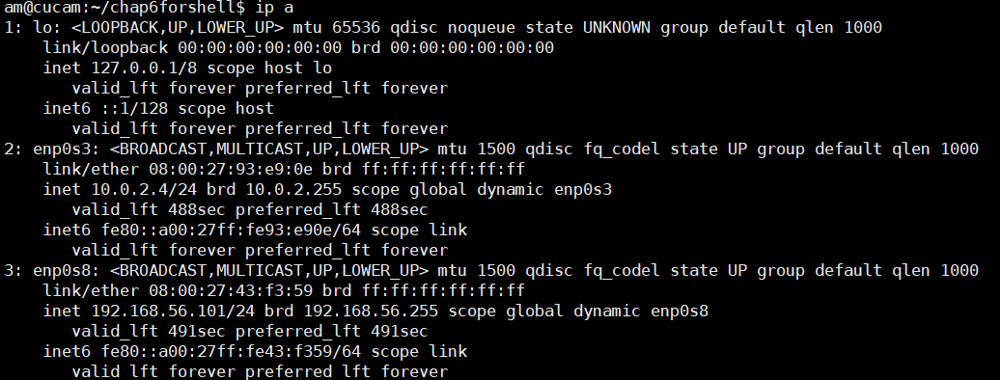
- 目标主机B
  - 虚拟机：VMware® Workstation 15 Pro (15.5.1 build-15018445)
  - Linux系统：Ubuntu-18.04.4 LTS desktop 64-bit
  - 配置nat和host-only网卡(192.168.179.134) 
  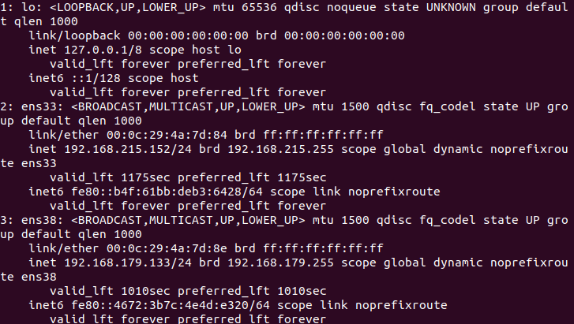

  
## 2.实验过程

#### ssh免密登录
---
- 在工作主机A上生成密钥对，这里我们直接默认（加-f省略个交互罢了）
  ```bash
  #ssh-keygen [-t rsa] [-P ''] [-f 「KEYPATH」]
  ssh-keygen
  # -f为密钥路径
  ```
- 在目标主机B上安装openssh-server
  ```bash
  sudo apt install openssh-server
- 修改目标主机B中sshd配置文件

  ```bash
  sudo vim /etc/ssh/sshd_config
  ```
  ```bash
  # 允许root用户远程登陆
  PermitRootLogin yes
  ```
  ```bash
  sudo systemctl restart ssh sshd
  ```
- 为后续传输公钥给root，设置root用户密码
  ```bash
  sudo passwd root #passwd:20011203
  ```
- 工作主机可通过`ssh-copy-id`/`scp`复制公钥两种方式将公钥传输到目标主机，我们这里采用较为方便的第一种，并在手动实验后回归原始状态用except脚本自动执行一次（注意更改目标主机的config设置）。
  ```bash
  sudo apt install expect
  bash sshrootNP.sh ~/.ssh/id_rsa.pub root 192.168.179.133 20011203
  ```
- 此时如果登录仍需要密码，我们在一番探索后从目标主机`sshd_config`中得到了解决办法（详见「3.2.1」）
  ```bash
  sudo vim /etc/ssh/sshd_config
  ```
  ```bash
  # 是否让 sshd 去检查用户家目录或相关档案的权限数据，
  # 防止使用者将某些重要目录文件的权限设错，可能会导致用户无法免密登入。
  StrictModes no
  
  # 证书登录替代密码登录。
  PasswordAuthentication no
  ```
- 此时在工作主机A执行`ssh root@192.168.179.133`，测试免密登陆成功！
  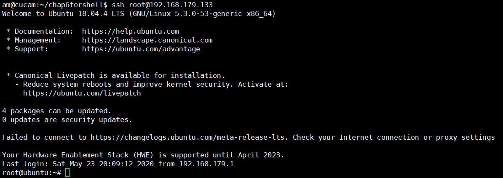

#### FTP：vsftpd
---

- [x] 配置一个提供匿名访问的FTP服务器，匿名访问者可以访问1个目录且仅拥有该目录及其所有子目录的只读访问权限；
  - 如下图使用匿名访问目标主机
    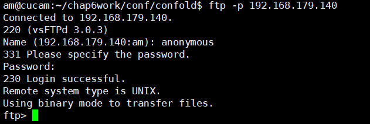
  - 相关配置
    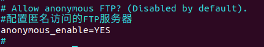

- [x] 配置一个支持用户名和密码方式访问的账号，该账号继承匿名访问者所有权限，且拥有对另1个独立目录及其子目录完整读写（包括创建目录、修改文件、删除文件等）权限；

  - 如下在linux工作主机端使用`sammy`访问目标主机
    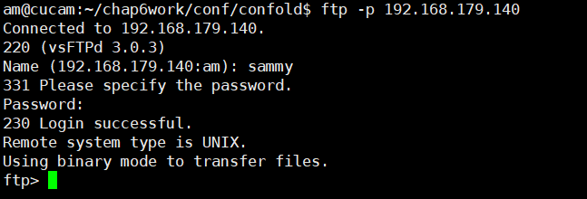
  - 在windows10端使用FileZilla访问目标主机并传输测试文件`test.txt`成功
    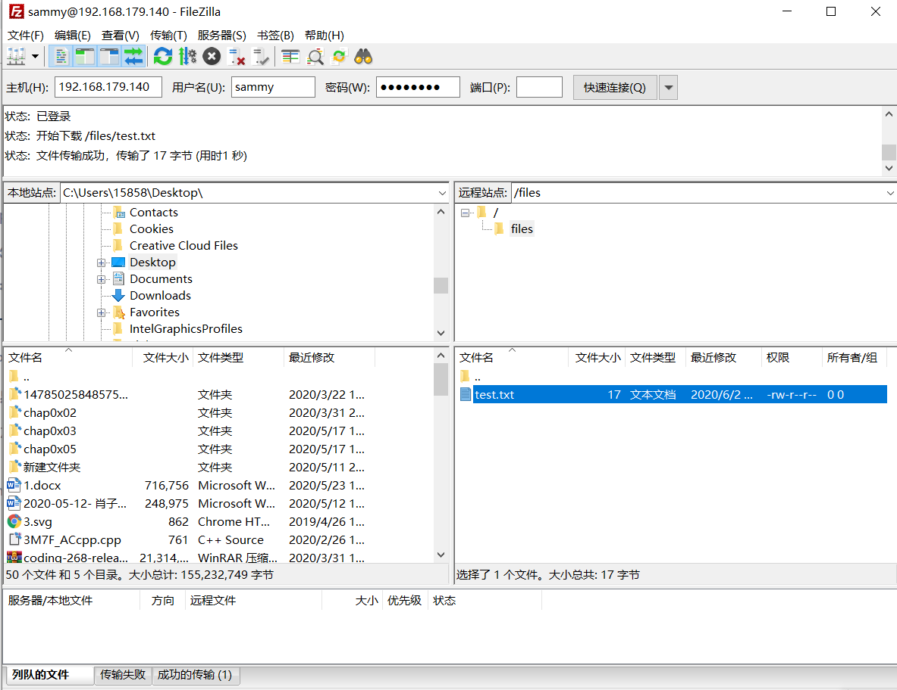
  - 相关配置
    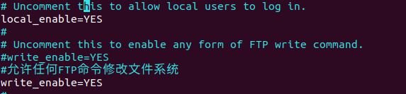
    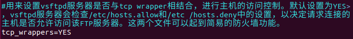
    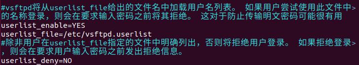

  - [x] 该账号仅可用于FTP服务访问，不能用于系统shell登录；
    - 第一种方法是在创建用户后执行`usermod -s /usr/sbin/nologin sammy`
    - 我们采用的是第二种方法，在创建用户时就添加shell选项，即如脚本所示`adduser --shell /usr/sbin/nologin "${FUSERname}"`
    - 在目标主机使用系统shell登录失败，Mission accomplished~
      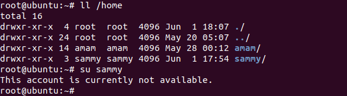

- [x] FTP用户不能越权访问指定目录之外的任意其他目录和文件；
  - 在这里我们加入一个`amftp`用户
    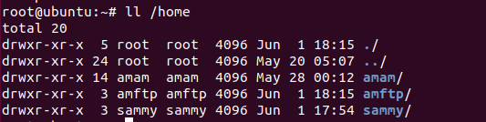
  
  - 相关配置
    

- [x] 匿名访问权限仅限白名单IP来源用户访问，禁止白名单IP以外的访问；
  - 白名单内IP来源用户可以访问
    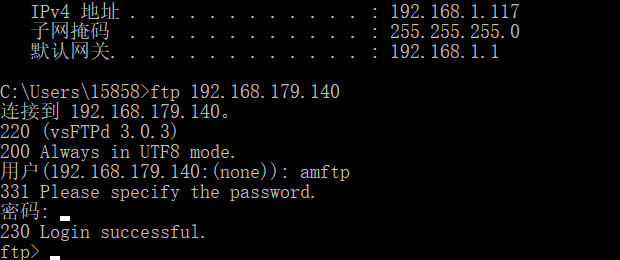
  - 白名单外IP禁止访问
    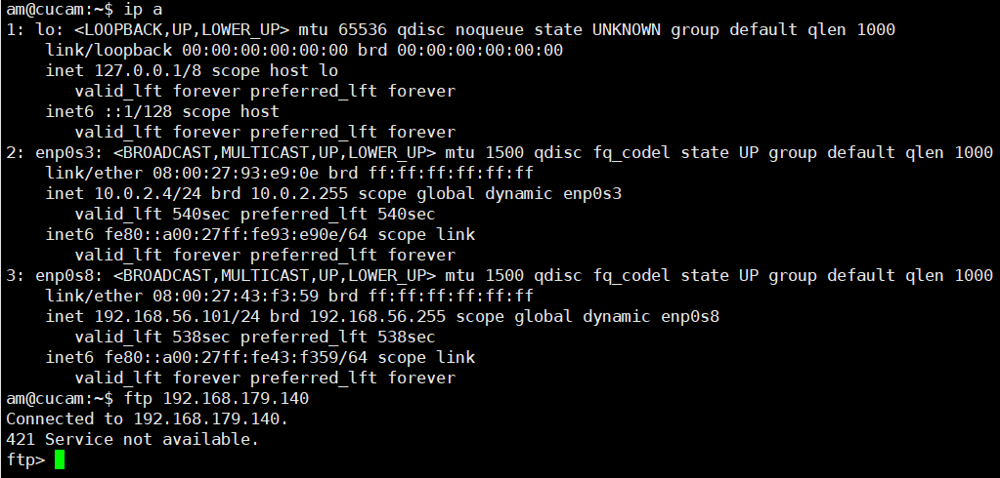
  - 相关配置
    ```bash
    #/etc/hosts.deny
      vsftpd:ALL
    #/etc/hosts.allow
      vsftpd:192.168.1.117
    ```

- [x] （可选加分任务）使用FTPS服务代替FTP服务，上述所有要求在FTPS服务中同时得到满足；
  - 为了实验方便实现我们先将白名单解除
  - 如脚本代码所示，我们通过`openssl`来创建一个新的证书，并进行如下配置：
    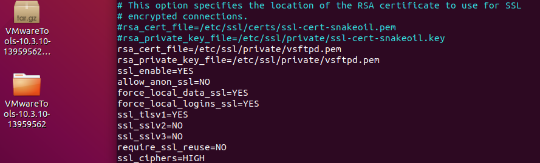
  - 使用直接ftp命令访问将会被拒绝
    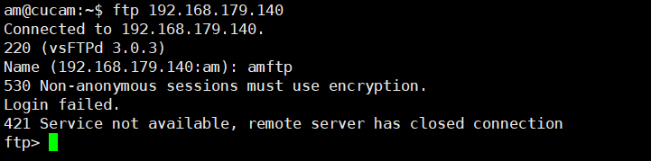
  - 在Filezilla中通过如下站点配置进行访问
    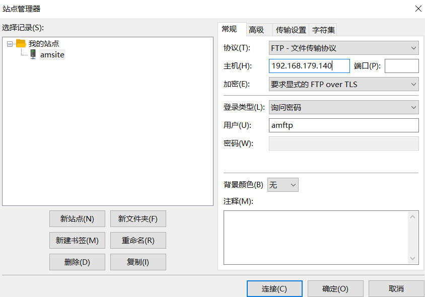
  - 生成如下证书
    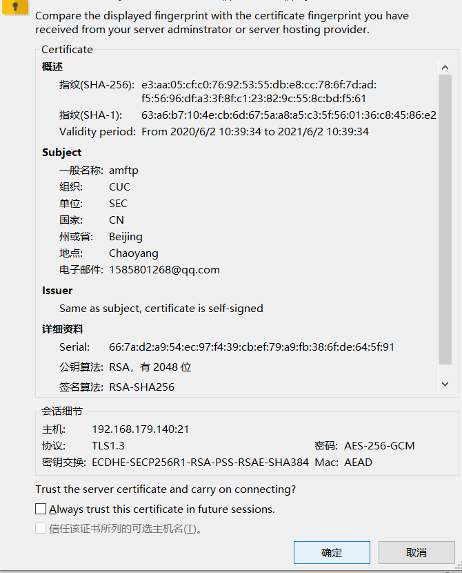
  - FTPS连接成功
    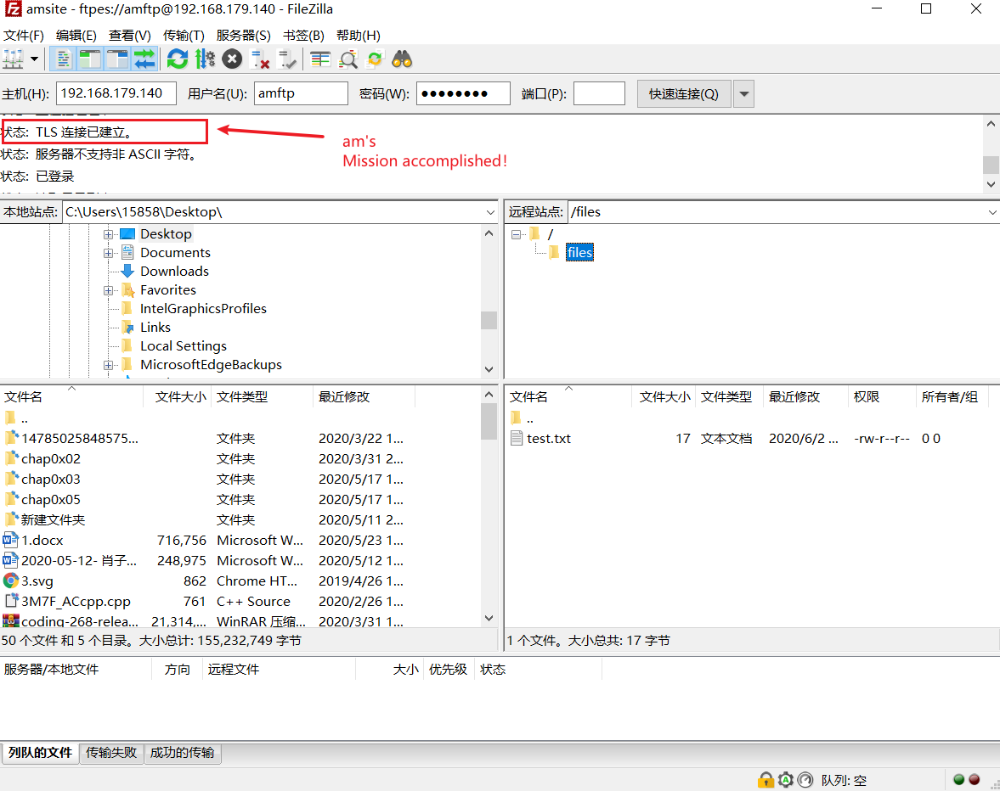
  - 传输文件测试
    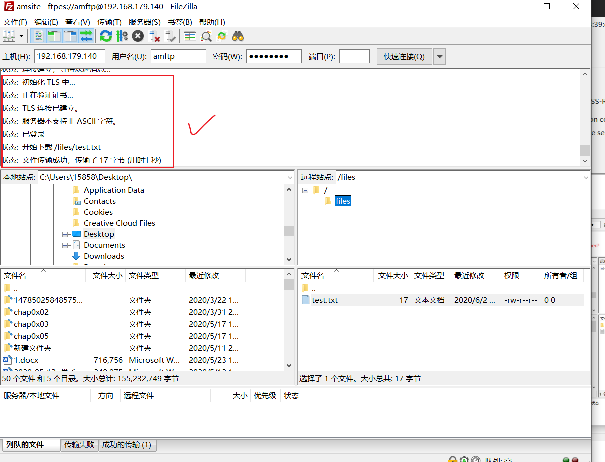

#### NFS

- [x] 在1台Linux上配置NFS服务，另1台电脑上配置NFS客户端挂载2个权限不同的共享目录，分别对应只读访问和读写访问权限；
  - 在工作主机上挂载目标主机上分配的共享目录
    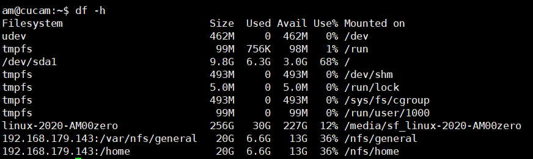
  - 只读访问权限测试
    
  - 读写访问权限测试
    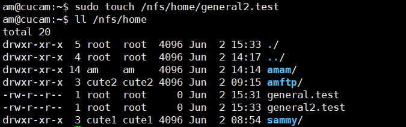
- [x] 实验报告中请记录你在NFS客户端上看到的：
  - [x] 共享目录中文件、子目录的属主、权限信息
    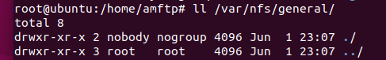
    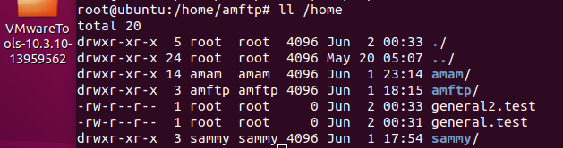

  - [x] 你通过NFS客户端在NFS共享目录中新建的目录、创建的文件的属主、权限信息
    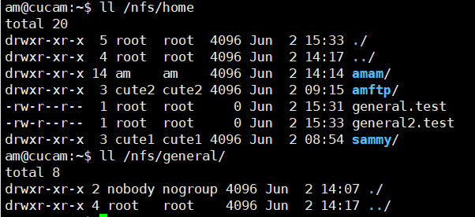

  - [x] 上述共享目录中文件、子目录的属主、权限信息和在NFS服务器端上查看到的信息一样吗？无论是否一致，请给出你查到的资料是如何讲解NFS目录中的属主和属主组信息应该如何正确解读。

    - 有些地方并不一样，虽然恰好我在host端也有三个用户（am，cute1、cute2）~~不要对取名产生误会！！~~，但是为什么挂载来的client的家目录的所属成为了host的用户呢？
    - [查阅资料👉](http://www.178linux.com/5603)

      >NFS服务本身没有身份验证的功能，权限是遵循共享目录在NFS服务器上的权限设置，而且只识别UID和GID。但当客户端访问此目录时，如果uid相符，那么访问者就有可能拥有与mysql用户相同的权限，这还要取决于/share设置共享时所分配的权限；如果访问者的uid对应了NFS服务器上的另一个用户，则访问者就对应拥有other权限，但是否能够完全对应用other权限也要取决于\share的共享权限；如果访问者的uid恰好在NFS服务器上不存在，则服务器用自动将其压缩成为匿名用户，其uid为65534，而CentOS将其显示为nfsnobody。由于在绝大部分Linux系统中root用户的uid为0，也就是说客户端可以轻易的获得NFS的root权限来访问共享目录，这样是极不安全的，所以NFS默认用将root的身份压缩成匿名用户。


    - 对于home目录，这里配置文件里将权限设置为no_root_squash，访问共享目录时保持root用户身份，所以在写入时显示的权限是一样的，均为root用户，而我host端挂载的家目录之所以用户不同，这和NFS对UID的一些处理的性质有关。

- [x] （可选加分任务）在客户端或NFS服务器上抓包分析使用NFS协议时的远程文件下载、上传、移动、删除等操作是否是明文？远程的文件传输数据流是否可以被恢复出完整的传输文件？
提示：我们在《网络安全》第4章《网络监听》中介绍过的工具filesnarf
  - 首先《网络安全》没听说过www
  - 应该是明文，用wireshark抓包截取NFS协议的相关操作，客户端操作及相关抓包如下：
    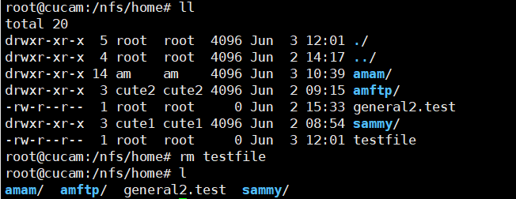
    
  

#### samba

- [x] Linux设置匿名访问共享目录：
  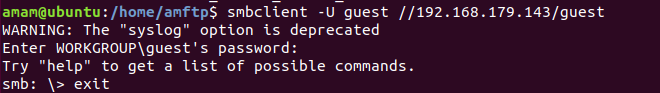

- [x] Linux设置用户名密码方式的共享目录
  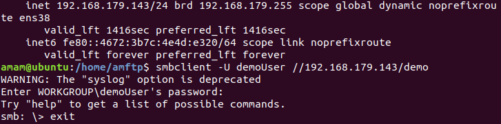

- 设置windows共享文件夹
  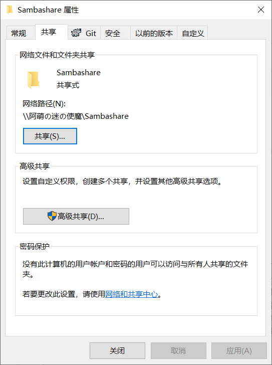

- 由windows访问linux端的匿名目录和userdemo目录
  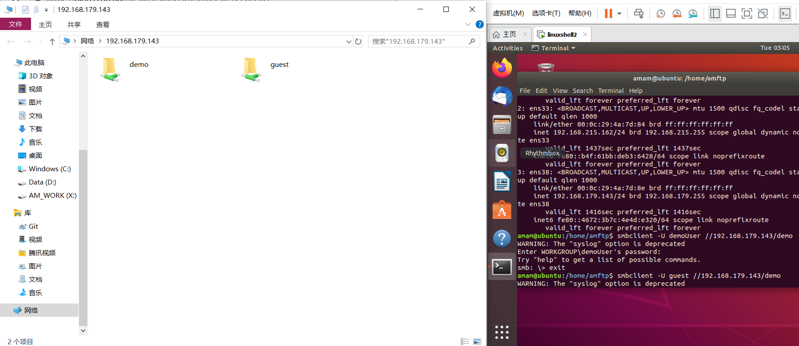

- 设置windows共享文件夹
  '
- [x]  Linux访问Windows的用户名密码方式共享目录
- 查看windows的所有共享目录
  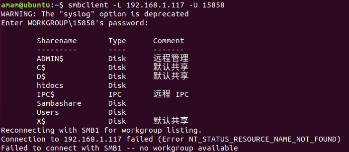

- [x] 下载整个目录
  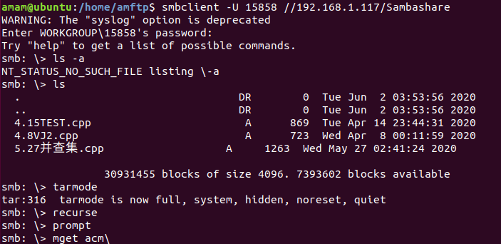
#### DHCP

- [x] 2台虚拟机使用Internal网络模式连接，其中一台虚拟机上配置DHCP服务，另一台服务器作为DHCP客户端，从该DHCP服务器获取网络地址配置
  - 修改server端`/etc/network/interfaces`文件
    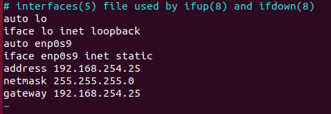
  - 修改server端`/etc/default/isc-dhcp-server`文件，配置提供DHCP服务的网卡
    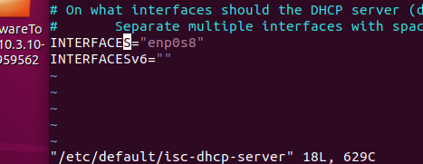
  - 在server端`/etc/dhcp/dhcpd.conf`文件进行如下修改
    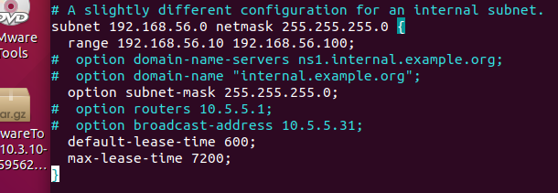
  - server端重启服务`service isc-dhcp-server restart`
  - 在client端`sudo vim /etc/netplan/01-netcfg.yaml`配置内部网卡的DHCP服务，将`enp0s9`的`dhcp4`打开，最终`ip a`查看DHCP配置结果如下
  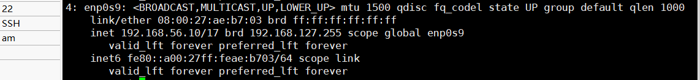

#### DNS

- [x] 基于上述Internal网络模式连接的虚拟机实验环境，在DHCP服务器上配置DNS服务，使得另一台作为DNS客户端的主机可以通过该DNS服务器进行DNS查询
  - 在server端`/etc/bind/named.conf.options`中设置信任客户端
    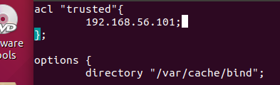
    同时在options选项中添加：
    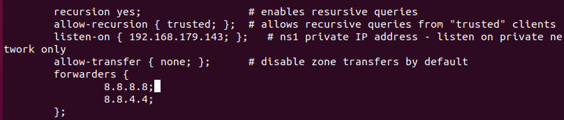
  - [x] 在DNS服务器上添加 zone "cuc.edu.cn" 的以下解析记录
  - 在server端`/etc/bind/named.conf.local`文件添加如下：
    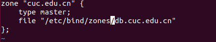
  - 创建相应目录与文件`db.cuc.edu.cn`，并修改如下：
    ```bash
    sudo mkdir /etc/bind/zones
    cp /etc/bind/db.local /etc/bind/zones/db.cuc.edu.cn
    ```
     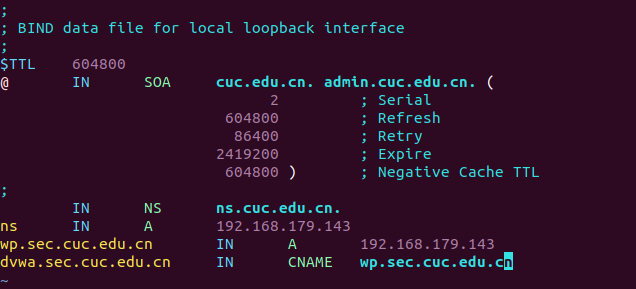
  - `sudo service bind9 restart`重启bind9服务
  - 在client端`sudo apt install resolvconf`安装并配置resolvconf文件`/etc/resolvconf/resolv.conf/head`如下
    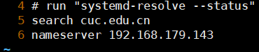
  - 执行测试如下
    ```bash
    sudo resolvconf -u
    dig wp.sec.cuc.edu.cn
    dig svwa.sec.cuc.edu.cn
    ```
    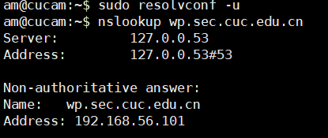
    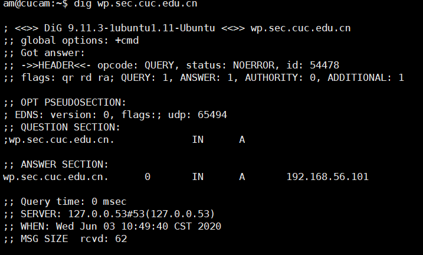
    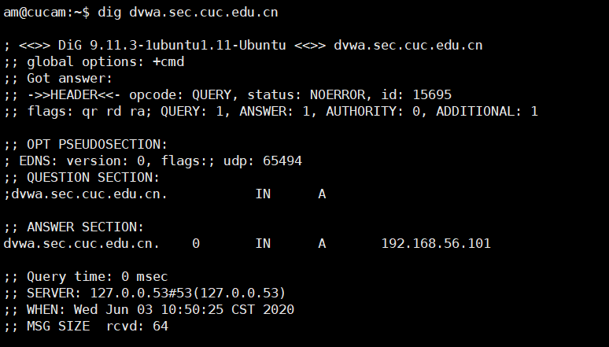
 
  

## 3.脚本及配置文件

#### conf

- FTP
  - [vsftpd.conf](https://github.com/CUCCS/linux-2020-AM00zero/blob/chap0x06/chap0x06/conf/vsftpd.conf)
  - [vsftpd.userlist](https://github.com/CUCCS/linux-2020-AM00zero/blob/chap0x06/chap0x06/conf/)
  - [hosts.allow](https://github.com/CUCCS/linux-2020-AM00zero/blob/chap0x06/chap0x06/conf/hosts.allow)
  - [hosts.deny](https://github.com/CUCCS/linux-2020-AM00zero/blob/chap0x06/chap0x06/conf/hosts.deny)
- NFS
  - [exports](https://github.com/CUCCS/linux-2020-AM00zero/blob/chap0x06/chap0x06/conf/exports)
- samba
  - [smb.conf](https://github.com/CUCCS/linux-2020-AM00zero/blob/chap0x06/chap0x06/conf/smb.conf)
- DHCP
  - [dhcpd.conf](https://github.com/CUCCS/linux-2020-AM00zero/blob/chap0x06/chap0x06/conf/dhcpd.conf)
  - [isc-dhcp-server](https://github.com/CUCCS/linux-2020-AM00zero/blob/chap0x06/chap0x06/conf/isc-dhcp-server)
- DNS
  - [named.conf.local](https://github.com/CUCCS/linux-2020-AM00zero/blob/chap0x06/chap0x06/conf/[named.conf.local)
  - [named.conf.options](https://github.com/CUCCS/linux-2020-AM00zero/blob/chap0x06/chap0x06/conf/named.conf.options)
  - [db.cuc.edu.cn](https://github.com/CUCCS/linux-2020-AM00zero/blob/chap0x06/chap0x06/conf/db.cuc.edu.cn)
  - [interfaces](https://github.com/CUCCS/linux-2020-AM00zero/blob/chap0x06/chap0x06/conf/interfaces)

#### script

[vars.sh](https://github.com/CUCCS/linux-2020-AM00zero/tree/chap0x06/chap0x06/shwork/var.sh) ：变量定义
[main.sh](https://github.com/CUCCS/linux-2020-AM00zero/tree/chap0x06/chap0x06/shwork/main.sh)：主函数
[prepare.sh](https://github.com/CUCCS/linux-2020-AM00zero/tree/chap0x06/chap0x06/shwork/prepare.sh)： 准备工作，如预执行apt、scp、cp、sed等命令
[ftp.sh](https://github.com/CUCCS/linux-2020-AM00zero/tree/chap0x06/chap0x06/shwork/ftp.sh) 、[dns.sh](https://github.com/CUCCS/linux-2020-AM00zero/tree/chap0x06/chap0x06/shwork/dns.sh) 、[nfs.sh](https://github.com/CUCCS/linux-2020-AM00zero/tree/chap0x06/chap0x06/shwork/nfs.sh) 、[dhcp.sh](https://github.com/CUCCS/linux-2020-AM00zero/tree/chap0x06/chap0x06/shwork/dhcp.sh) 、[samba.sh](https://github.com/CUCCS/linux-2020-AM00zero/tree/chap0x06/chap0x06/shwork/samba.sh) 、[ssh.sh](https://github.com/CUCCS/linux-2020-AM00zero/tree/chap0x06/chap0x06/shwork/ssh.sh) ：顾名思义完成相关任务

## 4.参考文献

#### shell/expect

[3.1.1 - Linux Expect 简介和使用实例](https://www.jianshu.com/p/70556b1ce932)

[3.1.2 - 为什么Shell命令用 sh 和用 source 执行会不一样](https://www.zhihu.com/question/27673228)

[3.1.3 - 缩进美观与<<-EOF](http://blog.chinaunix.net/uid-30360202-id-5172879.html)

[3.1.4 - shell脚本调用expect](https://blog.csdn.net/qq_27232757/article/details/77235613?utm_medium=distribute.pc_relevant.none-task-blog-BlogCommendFromMachineLearnPai2-1.nonecase&depth_1-utm_source=distribute.pc_relevant.none-task-blog-BlogCommendFromMachineLearnPai2-1.nonecase)

[shell脚本中针对sudo等密码输入的问题解决方案](https://www.cnblogs.com/shuo1208/p/6744876.html)

#### SSH

[3.2.1 - SSH无密钥登陆 与 配置公钥后仍需要输入密码的解决方案](https://blog.csdn.net/b_x_p/article/details/78534423?utm_medium=distribute.pc_relevant.none-task-blog-BlogCommendFromMachineLearnPai2-1.nonecase&depth_1-utm_source=distribute.pc_relevant.none-task-blog-BlogCommendFromMachineLearnPai2-1.nonecase)
  - 事实上因为免密登录配置公钥后仍需输入密码阻碍了有一天多时间，无论是文件/目录权限还是各种方法，查看的博客不计其数，重开的快照都要有十多个了，最后似乎是按照此博客里关于sshd_config的配置才终于可以免密？总之谢天谢地~orz

#### FTP

[3.3.1 - How To Set Up vsftpd for a User's Directory on Ubuntu 18.04](https://www.digitalocean.com/community/tutorials/how-to-set-up-vsftpd-for-a-user-s-directory-on-ubuntu-18-04)

[3.3.2 - manual of vsftpd.conf](http://vsftpd.beasts.org/vsftpd_conf.html)

[3.3.3 - linux中ftp配置文件详解](https://blog.csdn.net/lhq9220/article/details/6544755)
  - 对于tcp_wrappers官方manual甚至并不能给出对我有用的信息，反而此篇博客中豁然开朗

[3.3.4 - 拒绝用户登录:/bin/false和/usr/sbin/nologin](https://www.bbsmax.com/A/A7zg1Z9k54/)


#### NFS

[3.4.1 - How To Set Up an NFS Mount on Ubuntu 18.04](https://www.digitalocean.com/community/tutorials/how-to-set-up-an-nfs-mount-on-ubuntu-18-04)

- NFS挂载的时候卡了5个小时，市面上的解决办法错误的和不适用都用尽了，最后将client换成普通用户第1024次再一遍执行命令后，一边请教师姐然后就玄学通过了？？orz

#### Samba
[3.5.1 - Setting up Samba as a Standalone Server](https://wiki.samba.org/index.php/Setting_up_Samba_as_a_Standalone_Server)

#### DNS
[3.6.1 - How To Configure BIND as a Private Network DNS Server on Ubuntu 18.04](https://www.digitalocean.com/community/tutorials/how-to-configure-bind-as-a-private-network-dns-server-on-ubuntu-18-04)


